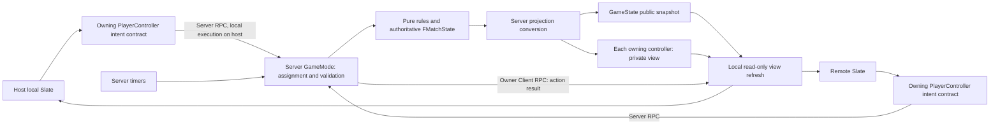

# Gomokards Card Gomoku

## Refactoring Progress

### Phase 1: Structural Split Without Gameplay Changes (Completed)

- Extracted the rules layer to `engine/rules.py`
- Extracted card metadata to `engine/cards.py`
- Added rule unit tests

### Phase 2A: State Consolidation (Initial Version Completed)

- Added `engine/state.py`
- Updated the main script to manage runtime state uniformly through `state.xxx`
- Changed `reset_game()` to delegate to `state.reset_match()`

### Phase 2B: Card Executor Registry (Initial Version Completed)

- Added `engine/card_effects.py`
- Changed instant-card logic in `handle_card_click()` to dispatch through executors
- Preserved the “select a point to cast” flow for deployment cards
- Added `tests/test_card_effects.py`

### Phase 2C: Cross-Rule Regression Test Matrix (First Batch Completed)

- Added `tests/test_cross_rules.py`
- Covered key cross-rule scenarios such as confusion, ghost, swap sides, barrier, and elimination

### Phase 2D: Fallback Rendering for Missing Assets (Initial Version Completed This Time)

Goal of this phase: keep the game runnable even when asset files are missing.

#### Completed

- Changed asset loading in `测试.py` to “optional loading”:
  - Missing files or load failures no longer crash the game.
- Added basic graphical fallback rendering:
  - Normal black/white stones, ghost stones, forbidden placement points, and Tetris blocks all support fallback drawing with `pygame.draw`.
- Added a runtime notification:
  - When missing assets are detected, a message appears at the bottom of the UI: “Basic graphics rendering mode enabled.”

### Phase 2E: Initial Bilingual UI Version (Completed This Time)

- Added a language selection dialog on first launch (English / Simplified Chinese).
- UI fixed text, card names, card descriptions, and key battle-log messages now support switching between English and Chinese.
- Added `engine/i18n.py` to centrally maintain the translation table and reduce hard-coded text.

## Suggested Later Phases (2E+)

1. Further separate input handling, rule resolution, and rendering
2. Add more fine-grained regression tests for the stone-placement flow and event loop

## Asset Loading Strategy

The current implementation supports two modes:

- Full asset mode: uses local image/font resources
- Fallback rendering mode: automatically draws basic graphics when assets are missing (runnable with simplified visuals)
- Pending with gomoku only mode

### Font Strategy (Preventing Garbled Chinese Text)

- Font loading uses a three-level fallback:
  1. Bundled font files inside the project (repository resource directory)
  2. A candidate chain of common system Chinese fonts (macOS / Windows / Linux)
  3. A final generic fallback font
- When publishing, it is recommended to bundle at least one commercially usable Chinese font (such as Source Han Sans / Noto Sans CJK), which can significantly reduce “tofu character” issues.

## Unreal Migration Phase 0 Baseline

Reviewed on `ue-migration` at `6f912d6ad57f65da5e206143a57035e74140c9b4`. `Gomokards/` already contains the Unreal 5.8 C++ bootstrap; retain its structure. Phase 0 is documentation only; Phase 1 gameplay and tests have not started. The development machine has 32 GB RAM; architecture is driven by correctness and scope, not assumed memory limits. The pygame implementation remains a behavioral reference.

### Authority and frozen rules

Authority, highest first: (1) explicit current user clarifications; (2) intentional gameplay supported by code/tests; (3) historical `五子棋.docx`; (4) inference. Record unresolved intent separately from observed event-loop behavior.

- Both hands start empty. Ordinary legal placement does **not** automatically draw. A successful block earns **exactly one card**. This intentional balance change supersedes the historical one-card-per-placement rule.
- Keep 19x19, black first, and four-direction connected lines of at least five; existing barriers can interrupt winning lines. No implemented Renju restrictions.
- One completed placement or basic card play is one action/turn. A click is input; selection/preview/targeting is local interaction, not a completed action. Invalid/cancelled requests change no authoritative state, RNG or turn. A valid no-op effect can still consume a card/turn.
- Current catalog: the ten entries in `engine/cards.py`, sampled uniformly with replacement, without finite-deck exhaustion or a hand cap. Preserve the reference catalog; unresolved effects are migration gates, not silently redesigned cards. Do not add advanced effects or unfinished cards to a playable pool.

### Exact blocking predicate

Preserve `has_double_end_block` in `engine/rules.py`. On the post-placement board, for both signs of horizontal, vertical and the two diagonals, require an immediately adjacent opposite-color run of length at least one. The new stone closes its near end; its far end must be outside the board or nonzero. Any qualifying run returns true; several qualifying rays still award only one card. An open far end or a gap next to the placed stone fails that ray.

The predicate ignores barriers, forbidden flags and reward history; an empty forbidden point is still empty. It does not validate origin occupancy/color or turn ownership; the action caller must. The caller supplies actual placed color, including confusion, and rewards the acting player's hand. Repeated future eligible placements are not deduplicated. Ghost's value-3 board currently prevents finding opposite-color runs; that mode interaction is unresolved, not a predicate redesign. Tetris locks and card plays never call placement rewards.

### Resolution and card eligibility

The ordinary-action contract is validate before mutation, place using the effective color, evaluate the win, award one card iff blocking succeeds, progress applicable effects, complete once, then transfer control only if play continues. Preserve reward on a winning placement. Commit the result atomically to presentation; terminal state rejects subsequent gameplay. Legacy unconditional turn toggles/acted flags are not additional actions. Card handlers return effects/results; only the common resolver advances the action.

| Category | Basic effects and current semantics |
| --- | --- |
| Defined for early core migration | Restock consumes itself then draws two. Swap Hands consumes itself before exchanging remaining hands. Steal selects a random opposing-hand entry; an empty opposing hand still costs the card/action. Nuke clears one in-bounds point and marks it forbidden, even if empty/already forbidden. None triggers placement reward. |
| Implemented, clarification gates | Polarity flips a full in-bounds 2x2, preserving empty points; simultaneous wins need a ruling. Confusion, Barrier, Back to Basics, Ghost and Tetris require the lifetime/interaction decisions below. Keep known behavior as reference rather than restoring historical descriptions automatically. |
| Excluded new content | Advanced/double-card effects, Joker, Ctrl+Z, Fast Duel, and incomplete concepts (curling, Ultimate Chicken Horse, Sokoban, lava floor). Fast Duel's historical 10 turns/4 seconds specifies a goal, not complete entry, timing and interaction rules. |

### Lifetimes, modes and win order

| State/effect | Current progression and end |
| --- | --- |
| Confusion | Casting sets 3 then immediately decrements to 2, replacing the previous count. Ordinary/hidden placements and non-Ghost immediate cards decrement a positive count; deployment cards and Tetris locks do not. Tests explicitly preserve Swap/Tetris activation decrement and Ghost activation non-decrement. Confirm untested deployment exceptions; do not replace all events with a generic turn decrement. |
| Polarity, Nuke, Barrier | Polarity is an immediate board mutation, not a timed modifier. Nuke forbidden flags and Barrier centers persist until reset; no decay. Current Barrier blocks all six pairwise links among the four corners of one cell, not a confirmed historical 7x7 cross. |
| Back to Basics | Sets the shared card lock; no expiry before reset in ordinary play, and no clearing of confusion/barriers/forbidden points. Confirm intended scope. Permanent prohibition and temporary mode restrictions must not share a blindly cleared flag in UE. |
| Ghost | Activation consumes a card/action, switches player, locks cards and starts a five-second preparation. Preparation currently allows ordinary placements and wins. Hidden mode then lasts six legal placements, bars cards and suppresses immediate wins; each hidden placement switches player and decrements its counter. Restore colors, unlock and scan wins after the sixth. Exit performs no extra turn switch: next player follows the sixth placement; without extra preparation moves this is the caster's opponent. |
| Tetris | Activation consumes a card/action and locks normal clicks/cards. Opponent of caster operates first, alternating six blocks (three each) in opposite colors. Left/right/down and Space rotation are supported; automatic downward steps use a 500 ms interval. Only a block lock completes a mode sub-action, not movement/timer input. Clear straight five-plus lines after each lock. Sixth lock exits/unlocks; normal player remains the caster's opponent. No block-placement reward or confusion decrement on locks. |
| Reset | Clears board, hands, forbidden points, barriers, effects, timers/mode state, outcome and pending interactions; starts black with zero cards. |

Current win-check sites: ordinary placement checks before reward/confusion decrement; Polarity scans after flipping and before card consumption; hidden Ghost placements skip checks, then restoration scans after the sixth placement/turn switch. Nuke and Barrier deployment have no new win check. Tetris performs elimination after locks and no explicit normal-win check at exit. Ordinary wins belong to the connected stone color, not automatically the acting player. Scanning order currently overwrites simultaneous winners; this is not an accepted tie rule.

### Unresolved rules and gates

- Determine no-legal-action outcome (a full board can still permit cards) and simultaneous-color wins. Do not invent pass/draw/last-scanned-winner policies.
- Decide Ghost preparation input and hidden-placement reward eligibility, including information revealed by a reward. Keeping true colors separate from display must not silently change that policy.
- Confirm Confusion deployment exceptions, Barrier footprint/anchor, and whether Back to Basics only prevents future plays or also clears existing effects. Tested exceptions remain compatibility requirements unless explicitly changed.
- Tetris needs blocked-spawn handling, forbidden-point/barrier interactions, downward-blocked versus historical any-direction-contact locking, and exit win adjudication. Six-block order and tested straight-line clearing are existing references, not grounds to invent the missing cases.
- Fast Duel and Ctrl+Z decisions are future scope, not blockers for the currently implemented catalog.

### Architecture, next phases and acceptance

Use one authoritative C++ match state and one validate/resolve/commit path within the existing module. UI-independent rules receive explicit actions and controlled randomness/time; Blueprint/UMG only submits requests and presents results. Board Actors/Widgets own no gameplay truth. Local targeting never writes match state. A small definition table and explicit card dispatch suffice. Do not require a scene/GameMode to test rules; a later GameMode can own the runtime state without creating a second mutable copy.

Next agreed phase is **Phase 1: UI-independent Unreal rules core**, after resolving decisions affecting its selected scope and receiving implementation authorization. Start with ordinary placement/reward and defined simple card transactions; gated effects must not masquerade as completed behavior. Phase 2 adds minimal presentation and clarified basic effects; Phase 3 adds clarified Ghost/Tetris and cross-mode regression. These are migration phases, separate from the historical pygame refactoring labels. Preserve pygame for comparison and independent rollback; compare fixed random outcomes across runtimes rather than assuming equal seeds produce equal Python/UE streams.

Phase 1 acceptance:
- Empty starting hands; ordinary non-blocking placement gives zero cards; successful blocking gives exactly one, including multiple qualifying rays and a winning placement.
- Illegal placement/failed action changes no board, hands, effects, outcome, RNG or turn; cancelled targeting does likewise. Card play gives no placement reward.
- Cover both colors, all eight rays, single/multiple stones, boundaries, gaps/open ends, ignored barrier/forbidden metadata and repeated eligible positions using the exact predicate.
- One accepted action completes once; terminal state rejects gameplay; reset cleans all authoritative state. Validate long lines, both diagonals, actual-color winner and card consumption order.
- Results do not depend on Widgets/Actors, frame rate or animation callbacks. Fixed initial state, actions and supplied random outcomes reproduce results.
- Existing three block tests cover an enclosed singleton, open far end and multiple runs returning true; they do not test actual reward counts, invalid inputs or complete action/UI independence. Add these regressions in Phase 1, not this documentation pass.

Required now: clear ownership, validation, action semantics and explicit decision gates. Premature: service layers, duplicate state snapshots, generic lifetime/undo systems, caching and performance frameworks. Future only: GAS, ECS, effect graphs, event sourcing, plugin card systems, networking/replication, advanced cards and unfinished modes. None is justified by the current board/card set.

## Unreal Migration Phase 1 Rules Core

Implemented on `ue-migration` from Phase 0 commit `a321a3e`. This section updates migration status; the Phase 0 record above remains historical. The existing Unreal module, bootstrap, configuration and pygame prototype are unchanged. No Phase 2 presentation or integration is included.

### Architecture and behavior

- `Public/Core/MatchState.h` and `Private/Core/MatchState.cpp`: plain value state, a 361-cell board, player collection with stable player IDs/default stone identities, current-player index, completed-action count, result and owned `FRandomStream`. Coordinates use `Y * 19 + X`. Reset reconstructs the complete state using the supplied seed (default 0); callers choose a seed explicitly for varied matches.
- `Public/Core/MatchRules.h` and `Private/Core/MatchRules.cpp`: read-only validation, ordinary win/block predicates and the single `ResolveAction` entry point. Effective stone identity has a separate helper; player identity owns hands/actions. Current two-player opponent selection is localized. Only 19x19, five-in-a-row and two players are supported.
- `Public/Cards/CardDefinitions.h` and `Private/Cards/CardDefinitions.cpp`: stable nonlocalized IDs and a four-entry playable definition table. `Private/Cards/CardEffects.h/.cpp` implements explicit effect dispatch. The common resolver consumes the played card, completes the action and advances the turn; effects do none of those independently.
- Invalid requests leave every authoritative field and RNG unchanged. Resolution uses a small candidate-state copy and commits only success. Public value fields support fixtures; a live owner must route changes through `ResolveAction`/`Reset` and expose only const state to future presentation. There are no UObjects, Actors, Widgets, GameMode dependencies or callbacks in the rules core.
- Ordinary non-blocking placement draws nothing. The exact legacy eight-ray blocking predicate awards one card, including multi-ray and winning placements. Forbidden metadata is deliberately ignored by that predicate, but enforced by placement validation. Winning identity follows the actual stone, not the player ID. A terminal match rejects further gameplay.
- Restock consumes one then draws two; Swap consumes itself before exchanging hands; Steal transfers one random card or validly consumes its action against an empty hand; Nuke clears and forbids a point, including empty/already-forbidden targets. Card actions never receive placement rewards. Duplicate-card Steal preserves the prototype's removal of the first matching card value.
- Per the Phase 1 instruction, **only Restock, Swap Hands, Steal and Tactical Nuke are generated**, uniformly with replacement. This intentionally narrows Phase 0's ten-card reference pool. Gated/unknown IDs return `UnsupportedCard`, never consume a card as a placeholder.
- Selection/cancellation has no match-state representation: validate without committing, or discard the request. A successful nonterminal action transfers once; a winning action completes once without transferring.

### Validation

Validated on Windows with Unreal **5.8.2**, Development Editor, MSVC 14.44 and Windows SDK 10.0.22621.0. Build succeeded. **9 Automation Tests passed, 0 failed, 0 test warnings, 0 skipped**. The final run disabled startup-map loading and used NullRHI; tests create no worlds, Actors, GameModes, Widgets or PIE sessions.

`Private/Tests/MatchRulesTests.cpp` covers reset/board conversion; invalid-action full-state/RNG equality; both colors and all eight blocking rays; singleton/multi-stone/open/gap/edge cases; ignored forbidden metadata; multi-ray and repeated rewards; five/long/broken lines in all directions; stone/player identity separation; winning reward and terminal rejection; four card transactions; deterministic pool sampling; and the explicit no-legal-action decision boundary.

Reproduce from the repository root in PowerShell (set the installed engine path):

```powershell
$EngineRoot = 'G:\GameDev\Unreal\UE_5.8'
$ProjectFile = (Resolve-Path './Gomokards/Gomokards.uproject').Path
$ReportPath = Join-Path (Split-Path $ProjectFile) 'Saved/Automation/Phase1'
& "$EngineRoot/Engine/Build/BatchFiles/Build.bat" GomokardsEditor Win64 Development "-Project=$ProjectFile" -WaitMutex -NoHotReloadFromIDE
& "$EngineRoot/Engine/Binaries/Win64/UnrealEditor-Cmd.exe" $ProjectFile -Unattended -NullRHI -NoSound -NoSplash -NoP4 '-ini:EditorPerProjectUserSettings:[/Script/UnrealEd.EditorLoadingSavingSettings]:LoadLevelAtStartup=None' '-ExecCmds=Automation RunTests Gomokards.Phase1' '-TestExit=Automation Test Queue Empty' "-ReportExportPath=$ReportPath"
```

Inspect the exported `index.json` test counts, not just process exit status. Generated build outputs, logs and reports stay in ignored directories and are not committed. Equal Python/Unreal seeds are not asserted to generate equal random sequences.

### Limits and next phase

- No-legal-action adjudication remains unresolved. After a completed non-winning action, if the next player has no legal placement or supported card, the core enters `AwaitingRuleDecision` with reason `NoLegalAction`, no winner, and rejects further actions until reset. This explicitly isolates the gap rather than inventing a draw/pass/loss.
- Starting from a clean match, the implemented actions cannot create simultaneous black/white wins: placement checks its new stone, terminal state stops play, and Nuke only removes stones. No simultaneous-win policy or general imported-state repair is implemented. Test fixtures are trusted value states, not a save-game import interface.
- Deliberately accepted constraints: fixed board/win constants, two current players, hands containing interchangeable card IDs rather than per-instance metadata, simple explicit dispatch, and copying a small state per action. These avoid a speculative framework while leaving player collections, stone identity resolution, card definitions and the action boundary available for later extension.
- Ghost, Tetris, Polarity, Confusion, Barrier, Back to Basics, Fast Duel, Undo/Joker, advanced effects, four-player rules, UI/Blueprint gameplay, board Actors, GameMode integration and networking remain unsupported. No additional modules/plugins/services were introduced.
- Next recommended phase: a minimal presentation adapter that sends requests and reads const state, after separate authorization. Resolve remaining Phase 0 decisions before adding affected cards/modes. Phase 2 has not started.

## Unreal Migration Phase 2 Local Playable Slice

Implementation continues from Phase 1 `e1a55e2d8bec6a4a486709f26f43b902d5eb415f` on `ue-migration`. **Phase 2 acceptance is complete:** agent-performed compilation, automation and implementation checks passed, and the user personally completed and passed hands-on gameplay validation. The Phase 0/1 sections above are retained as historical records.

### Impact check and ownership

The Phase 1 state, rules, card definitions/effects and all nine existing tests required **no changes**. Required integration work is limited to a runtime owner, local input/presentation, a startup map and three adapter/runtime tests. Later work may replace the development HUD with UMG and add localization. A generalized rules framework, reflected copy of the whole match, replication and new card mechanics are premature for this slice.

- `Source/Gomokards/Public/Runtime/LocalMatchGameMode.h` and its private implementation define `ALocalMatchGameMode`, the sole owner of one live `FMatchState`. It exposes a const query, submits to `ResolveAction`, returns rejection results unchanged, and broadcasts once on an accepted action or new match. There is no mutable Blueprint state API.
- Normal initialization and New Match derive a session seed from a new GUID. The core retains its owned deterministic `FRandomStream`. An explicit map URL option `?Seed=<integer>` is available for reproducible debugging; the normal Play/restart path does not silently reuse seed zero.
- `ALocalMatchPlayerController` creates/removes one local viewport view, shows the cursor and directs UI input to it. There is one controller for the two-player hot-seat match, with no controller-side match copy.
- `Public/Presentation/MatchPresentation.h` and its private implementation centralize pixel-to-integer conversion, result/rejection/card labels and small local target-selection intent. Pixel hit bounds are half-open; an outside click never clamps into a legal point.
- `Private/Presentation/SLocalMatchView.h/.cpp` defines the replaceable native Slate view and its board widget. Input becomes a placement/card request, goes through GameMode and the core, then the view reads the committed state. Rendered stones never determine occupancy. Selection, hover and feedback are presentation-only; hands and board are not mirrored in widget-owned arrays.
- `Content/Maps/LocalMatch.umap` is the only new content asset: an intentionally empty gameplay map. `Config/DefaultEngine.ini` selects it for editor startup and game startup, with `LocalMatchGameMode` as the default GameMode. The existing module adds only private `Slate` and `SlateCore` dependencies. No runtime plugin, Blueprint, material or legacy artwork is required.

### Launch and controls

Build the Development Editor target as in Phase 1, open `Gomokards/Gomokards.uproject`, and Play the default `LocalMatch` map (prefer a viewport or New Editor Window of at least 1100 x 800). No console command or state injection is needed to play. Both hands begin empty and cards are earned by successful blocks.

- Left-click a board point to place a stone. The active player, action count and action/rejection feedback are visible.
- Click an active-hand Restock, Swap Hands or Steal to play it immediately. Inactive-hand buttons are disabled. Card identity is always `ECardId`, never display text.
- Click Tactical Nuke to enter targeting, then click an occupied or empty board point to execute it. A yellow hover outline previews the coordinate; red squares with white X marks show forbidden points.
- Escape, right-click, or clicking Nuke again cancels targeting without submitting an action. Accepted changes and restart clear local selection.
- New Match / Restart reconstructs a clean match with a fresh seed and clears selection, hands, stones, forbidden points and result. Black starts again.
- A winner is displayed and gameplay is blocked after a win. `AwaitingRuleDecision` is explicitly labelled, assigns no invented win/draw, and permits restart.

The only playable pool remains Restock, Swap Hands, Steal and Tactical Nuke. Each accepted placement or card play completes one action. The existing empty-opponent Steal behavior, consume-before-swap order, exactly-one blocking reward and winning-block reward are preserved by the unchanged core.

### Validation and acceptance

Agent-performed validation: Development Editor build succeeded with Unreal **5.8.2**, MSVC 14.44 and Windows SDK 10.0.22621.0. Automation result: **12 passed, 0 failed, 0 test warnings, 0 skipped** (nine unchanged Phase 1 groups plus three Phase 2 groups). `Private/Tests/MatchPresentationTests.cpp` covers:

- `BoardCoordinates`: all 361 painted centers and edge/outside hit bounds.
- `TargetingIntent`: select/reselect/cancel without state or RNG mutation, complete targeted requests, invalid-target atomicity, stale-player rejection and explicit terminal labels.
- `RuntimeOwner`: a transient runtime world/owner, deterministic explicit seeding, acceptance versus rejection notifications, rejection full-state equality and clean fresh-seed restart.

Use the Phase 1 build/test commands with `Automation RunTests Gomokards` and report directory `Saved/Automation/Phase2` to run all 12. Read the exported `index.json` counts. The runtime-owner test creates a transient world; the Phase 1 tests remain UI/world-independent. Generated reports, binaries and caches are ignored.

Agent startup verification also confirmed that `/Game/Maps/LocalMatch` loaded with `LocalMatchGameMode`. The agent's earlier window-capture failure did not establish gameplay results and is no longer an acceptance blocker.

**User-performed manual gameplay validation: completed and passed.** The user personally tested the playable build and reported that all current Phase 2 gameplay logic works correctly. This hands-on result is user-reported, distinct from the agent's build, automated tests and static review. The requested manual validation gate is satisfied.

### Manual Gameplay Validation Checklist

The Phase 2 smoke pass below is complete per the user's report; retain this checklist for later regression passes in Unreal:

- Open `LocalMatch` and Play: an empty 19x19 board, empty hands and Black to act are visible. Place legal stones: the correct colors render and the turn changes once. Click an occupied point: feedback appears without spending an action.
- Close a known opposing run at both ends: exactly one card is added to the acting hand. Ordinary non-blocking placement adds none.
- Play Restock: consume it and draw two. Play Swap Hands: consume it before exchanging the remaining hands. Play Steal: transfer one opposing card; against an empty hand, still consume the card and action.
- Select Nuke and cancel using Escape, right-click or reselect: the hand, board and turn stay unchanged. Execute Nuke on occupied and empty points: each target becomes an empty, visibly forbidden point. Normal placement there is rejected without spending an action.
- Complete five in a row: show the correct winner and block further gameplay. Where practical, also close an opposing run with the winning placement and observe its one-card reward.
- Restart both from a result and with targeting pending: clear stones, forbidden points, hands, result and targeting, and start with Black again.

For future gameplay phases, the agent inspects C++ and Blueprint/Slate/UMG logic, checks state ownership and asset/config references, compiles, runs relevant Automation Tests and reports a concise manual checklist. The user performs hands-on gameplay validation; the agent does not play scenarios unless explicitly requested. Final commits require the user's pass report unless that gate is explicitly waived. Screenshots, when needed for editor inspection, do not substitute for gameplay validation.

### Deliberate limitations and next step

This is a fixed-size development HUD using engine-native lines, rounded stone shapes, colors and English text. Both hands are visible for testing, which establishes no permanent hand-visibility rule. It has no production responsive layout, art, audio, animation, gamepad/touch interface, saved games or packaged-build validation. Slate keeps the plain core independent of reflection; a future UMG view should add only the query/intent bridge it actually needs.

Preserved extension seams are the player collection (the view iterates it), player versus stone identity, stable card IDs/definitions, centralized coordinate conversion, local target intent and authoritative resolve/refresh boundary. No four-player rules, dynamic board, generic target framework, advanced effects, additional cards, special modes or networking were added. The Phase 0 unresolved rules remain unresolved, including no-legal-action adjudication and the gated card/mode interactions.

Phase 2 is accepted. Future work should prioritize playtesting feedback and rule clarification before migrating further cards or modes; no Phase 3 implementation is included.

## Unreal Migration Phase 3A Standard Cards

Implementation starts from completed Phase 2 `eb9437f92f05d8316b26b561a37411386ba2cdb4` on `ue-migration`. These explicit Phase 3A decisions supersede conflicting historical Phase 0–2 rules above. The user has completed hands-on Phase 3A testing and accepted Polarity inversion/Draw, Confusion color/action lifetime, Barrier targeting/connectivity and Basics card locking. The two Phase 3A.1 corrections below have a separate pending manual check. For this phase, the user explicitly authorizes an implementation commit/push after successful agent compile, automation and static checks, before their hands-on pass.

### Impact and state ownership

The same `ALocalMatchGameMode` owns one live value state and routes intentions to `ResolveAction`; no new runtime owner, UObject effect system, module, Blueprint, map or binary asset is required. `MatchState` gains `ConfusionActionsRemaining`, `bCardsDisabled` and `FBoard::Barriers` (unique cell anchors). Equality and reset include this metadata. `EMatchStatus::Draw` is a terminal result with no winning stone. Widgets still store only local target/hover intent and read committed state.

The existing definition table now uses a small `ECardTarget` enum for none, intersection, top-left region anchor or cell-center targeting. Exactly eight cards are generated uniformly with replacement: Restock, Swap Hands, Steal, Tactical Nuke, Polarity, Confusion, Barrier and Back to Basics. No unsupported IDs are generated.

### Rules and resolution

- **Polarity:** select the top-left intersection of a complete 2x2 region, matching pygame's anchor semantics (anchor coordinates 0–17 on each axis). Swap Black/White in those four cells, preserve empty cells and metadata, then evaluate the whole board. Black only or White only wins; both colors win simultaneously means Draw; neither continues. Scan order never selects the winner. This consumes one card/action without a placement reward.
- **Confusion:** casting establishes exactly two future successful actions. An affected placement uses the opposite of its player's assigned stone; player IDs and hand ownership do not change. Each successful placement/card action consumes one old duration. Invalid, rejected or cancelled interactions consume none. A recast consumes the old action then explicitly replaces the duration with two future actions. There is no set-to-three/decrement workaround. Winning color follows the actual stone; blocking rewards still belong to the acting player, including winning placements.
- **Barrier:** anchors are the 18x18 board cells. The four intersections A=(x,y), B=(x+1,y), C=(x,y+1), D=(x+1,y+1) share one `FBoard::RegionCorners` definition. A Barrier blocks exactly the six unordered local links AB, AC, AD, BC, BD, CD; all other links remain unchanged. It removes no stones and persists until restart; Basics does not remove it. Duplicate deployment consumes a valid card/action but stores only one anchor. Win detection checks each traversed link. The legacy blocking-reward predicate still deliberately ignores barriers.
- **Back to Basics (corrected in Phase 3A.1):** only disable future card play until restart. Consume the played card and complete/transfer once normally; preserve the board, forbidden flags, Barriers, other hand entries and existing effects. Playing Basics while Confusion is active consumes one action through the normal successful-action lifecycle, but does not otherwise clear or rewrite the effect (2 becomes 1, then the next successful placement remains confused and expires it). No special global win reevaluation occurs: Polarity still performs its global scan and placement retains its normal win check. Disabled card requests return `CardsDisabled`; disabled cards do not count as available actions on a full board. Future blocking rewards still add cards, which remain visible but inert.
- **Terminal behavior:** Won and Draw reject later gameplay and do not transfer control after the terminal action. New Match clears results/effects and restores card availability. A full board with no legal action remains `AwaitingRuleDecision`, not an invented draw. No sudden-death duel, post-draw play or timers are implemented.

### Presentation and shared geometry

The existing Slate HUD adds four card labels/buttons, Confusion duration/effective placement color, a card-disabled notice and explicit Draw text. Inert cards remain visible with disabled buttons. Targeting is local, and Escape/right-click/reselect cancels without a resolver call.

`FBoardLayout::TargetAt` centralizes hit conversion: normal placement/Nuke use intersection hit areas; Polarity uses a valid top-left intersection; Barrier uses the square between its four surrounding intersections. Barrier preview and committed rendering use the same small cyan/yellow cross endpoints derived from the core's corner definition. Polarity previews its four-point region. The placement hover shows the effective stone color and consults core validation. Neither visual geometry nor occupancy becomes game truth. Invalid edge targets reject without consuming the selection, card, action, duration or RNG.

### Agent validation

Agent-performed validation completed on Unreal **5.8.2**, Win64 Development Editor, MSVC 14.44 and Windows SDK 10.0.22621.0. **Build succeeded. All 21 Automation Test groups passed: 9 Phase 1, 3 Phase 2, 9 Phase 3A; 0 failures, 0 test warnings, 0 skipped.** The exported report was inspected, not inferred from process exit. Static review confirmed one authoritative state, the resolver mutation path, shared targeting geometry, disabled/terminal input guards and existing asset/config references. No agent-driven hands-on gameplay was performed. The user subsequently reported the accepted Phase 3A checks listed above; the Phase 3A.1 correction check remains pending.

The nine Phase 1 and three Phase 2 test groups are retained. Only two obsolete Phase 1 expectations change: the pool is now eight cards, and the four newly implemented IDs are removed from the unsupported-ID list. All other prior assertions remain. New `Private/Tests/StandardCardsTests.cpp` covers Polarity single/no/simultaneous results and scan-order independence; Draw rejection/reset; Confusion duration, refresh, actual-color wins and acting-hand rewards; all 324 Barrier anchors and six symmetric links; four-direction connectivity; Basics state/effect preservation, normal Confusion progression, no special global scan, inert rewards and disabled-hand no-legal-action handling; exact pool/determinism; target domains/cancellation; and reachable manual setups replayed solely via normal actions. The replay tests are automated rules checks, not human gameplay validation.

Reproduce with the Phase 1 build command, then `Automation RunTests Gomokards` and report directory `Saved/Automation/Phase3A`; inspect exported `index.json`. Existing `LocalMatch` map and configured GameMode references remain unchanged. Build outputs, logs, test reports and caches remain ignored.

### Phase 3A manual reference — user testing completed

Pull `ue-migration` into your main checkout, close its editor before rebuilding, compile Development Editor, then open `LocalMatch`. Use at least 1100x800 for the development HUD. Coordinates below are zero-based intersections from top left. A Barrier anchor `(x,y)` means click the center between `(x,y)` and `(x+1,y+1)`.

For reproducible card acquisition, optionally use the existing explicit session seed instead of repeatedly drawing: using `$EngineRoot` and `$ProjectFile` from the build example, launch `& "$EngineRoot/Engine/Binaries/Win64/UnrealEditor.exe" $ProjectFile '/Game/Maps/LocalMatch?Seed=7' -game -windowed -ResX=1100 -ResY=800`. Relaunch with a different seed for another scenario; New Match intentionally generates a fresh seed. This changes only the initial RNG seed and never injects board state or hands.

1. **Basic regression / acquire a card:** in a fresh match click `(0,0)`, `(1,0)`, `(2,0)`, `(18,18)` in order. Black earns exactly one card on action 3; ordinary moves give none; Black acts next at action count 4. Seed 7 earns Polarity, seed 10 Confusion, seed 12 Barrier, seed 15 Basics. Clicking an occupied point must leave action count/turn/hand unchanged.
2. **Polarity targeting and ordinary inversion:** with seed 7's opening, select Polarity; preview must cover four points from the selected top-left intersection. Try a last-row/column anchor and cancel: no authoritative change. Reselect and click `(0,0)`: only `(0,0)` becomes White and `(1,0)` becomes Black; empty lower corners stay empty; card disappears and White acts once. Nuke remains intersection-targeted.
3. **Simultaneous win / Draw:** relaunch seed 7, do the four opening moves, then click `(0,2)`, `(0,3)`, `(1,2)`, `(1,3)`, `(2,2)`, `(2,3)`, `(3,3)`, `(3,2)`, `(4,3)`, `(4,2)`. Black plays Polarity at `(3,2)`. Both five-stone rows must form, Draw must show at completed action 15, neither color is named winner, and subsequent placements/card plays must be blocked. Restart must clear everything and restore Black/empty hands/cards enabled.
4. **Confusion lifetime and rejection:** use seed 10's opening, then Black plays Confusion. It must show 2 remaining actions and White to act. An occupied click leaves 2. White places `(5,5)`: Black stone, 1 remaining. Black places `(7,7)`: White stone, effect ends. White places `(9,9)`: White stone normally. Separately, while active, play any available card instead of placing: exactly one old action expires. Selecting/cancelling a target consumes none. For a reproducible recast setup, relaunch seed 10 and click `(0,0)`, `(1,0)`, `(2,0)`, `(4,4)`, `(5,4)`, `(6,4)`; both players earn Confusion. Black casts it, then White recasts: the visible count must refresh to 2 after the second card action rather than stack or immediately reduce it. The following two successful actions exhaust it.
5. **Barrier targeting/connectivity:** use seed 12's opening, select Barrier, hover the cell anchored `(6,8)` and cancel once. The preview must be centered between intersections; no stone/card/action changes. Deploy there: cyan small cross appears, no stones removed, White acts. Fill a Black horizontal run `(5,8)` through `(9,8)`, interleaving White moves at spaced distant points; the Barrier must prevent a win across `(6,8)`–`(7,8)`. Other unblocked runs still win. Also deploy at boundary cell `(17,17)` when a Barrier is available; outside-cell targeting rejects without spending an action.
6. **Basics state preservation (Phase 3A.1 correction):** with an existing Barrier, Nuke forbidden point and active Confusion, play Basics. The Barrier and forbidden point remain; all other hand entries remain visible but disabled. Confusion progresses by the normal one-action step and any remaining action still affects the next placement. Previously removed stones stay absent and flipped colors stay flipped. Basics itself does not trigger a global win scan. Restart clears the normal match state and card lock.

### Accepted limits and remaining scope

The fixed-size English development HUD and both-hands-visible policy remain temporary. Eight-card hands may require scrolling. There is no art/polish, production responsive layout, packaging validation, replay/save-game importer or in-game fixture editor. Small value-state copying, a plain anchor array, explicit effect dispatch and full-board scans after connectivity mutations are intentional simple choices for a 19x19 board. No generalized effect framework or arbitrary topology was added.

Ghost, Tetris, Ctrl+Z/Undo, Fast Duel, Joker, advanced/double-card effects, networking, four-player rules and sudden-death draws remain unsupported. Phase 3B has not started. The user's accepted Phase 3A checks are recorded above; only the short Phase 3A.1 correction checklist below is pending.


## Unreal Migration Phase 3A.1 Corrections

**Historical rule record:** Phase 4B.3 below supersedes only the Basics/Confusion preservation rule: Basics now clears active Confusion while retaining all board history. Earlier tests and manual steps describing Basics taking Confusion from 2 to 1 are historical, not the current acceptance criteria.

Continues from `54bec6478de6082c464efc8f565e8225071ed10b`. No cards, modes, assets or topology were added. The Phase 3A rules above are corrected to reflect the current authoritative Basics behavior; unrelated Phase 0–2 history is retained.

- Barrier preview and committed rendering both call the existing `FBoardLayout::BarrierCross`. Each arm now extends **12.5% of one cell spacing** beyond its nearest grid line. This is presentation only: `RegionCorners`, `IsLinkBlocked`, the six blocked links, 18x18 anchor domain and hit conversion are unchanged.
- Basics now only sets the card-disabled flag. Removed its board-metadata cleanup, Confusion-clearing exception and global winner/Draw scan. Normal action completion still decrements existing Confusion. The HUD now displays both card lock and remaining Confusion together.
- Focused tests update only superseded Basics expectations and add preservation, continuing confused placement, inert future reward, persistent Barrier win blocking, absence of a Basics-triggered winner/Draw scan and proportional visual-overhang checks. Existing unrelated coverage is retained.

Agent validation: Unreal 5.8.2 Win64 Development Editor build succeeded. The complete `Gomokards` suite exported **21 passed, 0 failed, 0 test warnings, 0 skipped** (9 Phase 1, 3 Phase 2, 9 Phase 3A groups), verified in `Saved/Automation/Phase3A1/index.json`. Static review confirms preview/render share the extended endpoints and gameplay topology/hit conversion are unchanged. Hands-on correction validation is **pending the user**, and does not block this implementation commit. No agent gameplay or screenshot automation was performed.

### Manual Gameplay Validation Checklist — Phase 3A.1 only

A. Select Barrier and inspect its preview, then deploy it. All four arms should extend slightly across the nearest grid lines; preview and committed shape should agree. Targeting and connectivity must behave as before.

B. With an existing Barrier, a Nuke forbidden point and Confusion at 2, play Basics. Expect cards disabled and other cards retained visibly; Barrier/forbidden point unchanged; Confusion 2 -> 1. A rejected card/forbidden-point request must not reduce it. The next valid placement still uses the opposite color and takes Confusion to 0. Normal placement remains available, the forbidden point stays forbidden and the Barrier still interrupts connectivity. No full replay of already accepted Phase 2, Polarity or Draw scenarios is requested.

## Unreal Migration Phase 3B Ghost

Continues on `ue-migration` from Phase 3A.1 `cb8d1290a19189a9581ae849ab42779cf736cab0`. **The user has accepted the Phase 3A.1 baseline**, including corrected Basics behavior and Barrier geometry/topology. Earlier sections retain their historical validation status; this section records the current baseline and supersedes their obsolete pool/unsupported-card statements. Phase 3B implements **Ghost only**. The implementation commit/push was authorized after agent checks and before the hands-on pass. The user has subsequently completed and passed manual Ghost gameplay validation.

### Impact, state and timer ownership

One `ALocalMatchGameMode` still owns one authoritative `FMatchState`. The only new rules state is `EGhostPhase { None, Preparation, Hidden }` and `GhostPlacementsCompleted`, with a fixed limit of six. Equality/reset include both. The board still stores only Empty, Black and White: no gray identity, color snapshot or restoration pass exists.

Ghost is a non-targeted card. `ResolveAction` consumes it, progresses any existing Confusion once, completes one action and transfers normally into Preparation. **The 5-second preparation period freezes gameplay.** Authoritative validation rejects all gameplay requests without state/RNG changes; Slate also disables board and card input. The next player remains visible and retains the turn. Stones retain true colors throughout Preparation.

GameMode owns a core `FTSTicker` callback and a monotonic `FPlatformTime::Seconds()` deadline five real seconds after casting, independent of world time dilation/pause. The first runtime tick at/after the deadline calls the explicit, deterministic `BeginGhostHidden` transition and broadcasts once. That transition changes only Ghost phase/count; it never spends an action, changes player, advances Confusion or draws cards. The display countdown is derived from the runtime deadline, never authoritative rules state. Weak callback binding, cancellation on restart/EndPlay/destruction and a generation token prevent old callbacks from affecting a new match or a newer Ghost cast. Automation invokes the deadline check directly without sleeping. No generic scheduler or phase framework was added.

### Hidden placement and reveal rules

- Hidden permits only legal placements. All card play/targeting is temporarily prohibited, independently of the permanent Basics lock. Occupied, forbidden and out-of-bounds requests preserve the entire state, including counters and RNG.
- Each placement stores its true effective color immediately. Confusion uses the existing lifecycle: remaining 2 -> Ghost cast leaves 1 -> Preparation leaves 1 -> first Hidden placement uses the opposite color and leaves 0. Ghost does not clear or refresh it.
- **Hidden Ghost placements retain normal successful-block card rewards; visible reward information is intentional.** The unchanged blocking predicate sees true colors, still ignores Barrier metadata, and grants exactly one card to the acting hand even for multiple qualifying rays or a winning placement. Earned cards stay visible but cannot be played until Ghost ends.
- Each successful placement advances the Hidden count once. The first five suppress immediate winning termination, preserving any completed lines. The sixth resolves placement, reward and Confusion first, then clears Ghost and performs the existing full-board evaluation using true colors and Barrier connectivity: Black only wins, White only wins, both means Draw, neither continues. The action completes once; only a continuing match transfers normally, with no additional reveal turn switch.
- Existing Barriers, Nuke forbidden/removed points, committed Polarity colors and hands persist. Reveal clears only Ghost's temporary restriction; it cannot clear an independent Basics lock. Restart uses the existing complete state reset, cancels the runtime timer, restores visibility and starts Black with empty hands.

The prior core changes are limited to Ghost state/equality, validation, card availability, the explicit timer transition and delayed reveal adjudication. The accepted blocking predicate, Barrier topology, Basics effect and Polarity evaluation remain unchanged. Preparation is exempt from the ordinary post-action no-legal-action check because it awaits a runtime transition rather than player input.

### Presentation and playable pool

The existing Slate HUD shows the Preparation countdown and Hidden placements remaining. A shared `StoneDisplayColor` maps every occupied Hidden stone and placement preview to identical gray; true effective color is also omitted from the Hidden Confusion label. Forbidden markers, Barrier crosses, current player and reward/hand changes remain visible. Reveal immediately returns true-color rendering from the same authoritative board. Slate owns no gameplay timer or match copy.

Exactly nine cards are generated uniformly with replacement: Restock, Swap Hands, Steal, Tactical Nuke, Polarity, Confusion, Barrier, Back to Basics and Ghost. No new assets, Blueprint classes, modules, plugins, maps or config references are needed; `/Game/Maps/LocalMatch` and `/Script/Gomokards.LocalMatchGameMode` remain the launch references.

### Agent validation and manual status

Unreal **5.8.2 Win64 Development Editor build succeeded**, using MSVC 14.44 and Windows SDK 10.0.22621.0. Full `Gomokards` Automation export: **29 passed, 0 failed, 0 test warnings, 0 skipped, 0 in progress**: 9 Phase 1 + 3 Phase 2 + 9 Phase 3A + 8 Phase 3B groups. Counts were read from `Saved/Automation/Phase3B/index.json`, not inferred from process exit. Reproduce using the earlier build/test commands with `Automation RunTests Gomokards` and that report directory.

The eight Ghost groups cover activation/preparation atomicity; Hidden counting/restrictions; true-color rewards and Confusion; all four reveal outcomes; early/sixth winning rewards; persistent effects/reset; visibility/pool/determinism; and runtime deadline, one-shot notification, restart/stale-callback/teardown behavior. Existing groups remain, with only superseded pool/unsupported-ID expectations updated. An initial failed run exposed incorrect seeded test setup assumptions: White earns an edge-block reward before Black's opening reward. Correcting the setups preserved the existing rules and all prior assertions; the final complete rerun passed.

Static review checked state ownership, action ordering, timer lifecycle, Slate targeting/color/refresh paths and existing map/config references. Generated binaries, caches, logs and test reports are ignored and excluded from the commit. No agent gameplay or screenshot automation was performed. **User-performed manual Ghost gameplay validation is completed and passed**, reported by the user after testing Phase 3B commit `ea5f4500449ffe1957b60d9e7227ea55592741e0`. This hands-on result is distinct from the agent checks above; the checklist below is retained as the completed validation reference.

### Manual Gameplay Validation Checklist — Ghost only

Use the existing launch procedure with `/Game/Maps/LocalMatch?Seed=9`. Coordinates are zero-based. Play `(0,0)`, `(1,0)`, `(2,0)`, `(18,18)`: White earns Confusion on move 2 against the edge, Black earns Ghost on move 3, and Black acts next. This normal-action acquisition is exercised by the runtime automation test. Old eight-card seed examples are historical; for this nine-card opening, Polarity remains seed 7 and Confusion seed 10, while Barrier is seed 13 and Basics seed 6. Restart intentionally changes the seed; relaunch for a repeatable setup.

1. **Cast/freeze:** Black plays Ghost. Expect one consumed card/action, White next, five seconds of visible Black/White stones and a countdown. Board/card clicks during the countdown do nothing; action count, turn and Confusion stay fixed. At timeout all occupied stones become identical gray.
2. **Counter/reward/reveal:** White places `(0,1)` during Hidden: expect gray, remaining 6 -> 5 and one visible blocking reward. Click an occupied point: no count/action/turn change. Card buttons, including earned cards, remain unusable. Continue with five legal spaced placements such as `(6,6)`, `(8,8)`, `(10,10)`, `(12,12)`, `(14,14)`: each decrements once, the sixth reveals true colors, removes Ghost status and restores the active player's cards if the match continues and no independent lock exists.
3. **Confusion:** Relaunch seed 9; use the first three opening moves, then White plays its Confusion instead of `(18,18)`. Black casts Ghost: Confusion 2 -> 1, unchanged throughout Preparation. White's first Hidden placement appears gray; after reveal it must be Black, with Confusion having expired after that first placement. Invalid clicks must not spend its duration or expose color through the preview.
4. **Persistent effects:** In a match with Ghost plus an existing Nuke forbidden point/Barrier, cast Ghost. Their marks remain visible, forbidden placement does not reduce the counter, and the Barrier still blocks winning connectivity at reveal. Existing removed/flipped stones retain their state. Test only these Ghost interactions, not a full replay of accepted cards.
5. **Delayed wins:** Before casting Ghost, arrange four Black stones in row 2 and four White stones in row 5 without completing either line. During Hidden complete White's row on placement 1 and Black's on placement 2; neither ends play. Placement 6 reveals Draw. Repeat with only one prepared/completed line to check its correct winner; the no-line case in step 2 continues normally. A winning hidden block still earns its one card, including on placement 6; terminal reveal blocks later gameplay without an extra turn transfer.
6. **Restart:** Restart once during Preparation, once during Hidden and once after a revealed result. Expect an empty, normally visible board, empty hands, Black to act, normal card availability and no Ghost/countdown. Wait beyond the abandoned Preparation deadline: the new match must stay normal.

### Accepted limits and unsupported scope

The fixed-size English development HUD, visible hands, small state copies and full-board reveal scan remain intentional. Timer delivery occurs on the next engine tick after its real deadline; a suspended process cannot repaint or execute callbacks until resumed. Packaged-build validation, production UI/art/localization and save/replay imports remain out of scope. The pre-existing no-legal-action adjudication gap is retained: an exhausted board before six Hidden placements cannot complete the normal Ghost sequence, and no pass/early reveal/draw rule is invented; restart remains available.

Tetris, Fast Duel, Ctrl+Z/Undo, Joker, advanced/double-card effects, networking and four-player modes remain unsupported in the Phase 3B baseline. No speculative framework or additional card implementation is included in that phase. Phase 3B is complete and its manual Ghost pass is accepted. Subsequent authorized Phase 3C work is recorded below.

## Unreal Migration Phase 3C Tetris

Continues on `ue-migration` from accepted Phase 3B `ea5f4500449ffe1957b60d9e7227ea55592741e0`. The user personally completed and passed Ghost gameplay validation; its status above is updated. This phase implements **Tetris only**, using the newly specified four-edge rules. Earlier migration records remain historical. The user authorizes one implementation commit/push after agent validation, before the manual pass. The user subsequently passed core Tetris functionality and identified the against-gravity movement issue corrected in Phase 3C.1; focused manual recheck has now passed per the user.

### Impact, ownership and action boundaries

`ALocalMatchGameMode` remains the only live owner of one `FMatchState`. New `FTetrisState` contains active status, one-based block opportunity, operator index, shape, clockwise rotation, origin, edge and true color. Gravity derives from the edge. Equality/reset include the whole value. There is no falling-piece copy in Slate, physical Actor or generic mode framework.

Tetris goes through `ResolveAction`: consume once, progress existing Confusion once, complete one ordinary action, transfer once to the opponent, then `BeginTetris` spawns for that opponent. Explicit `ApplyTetrisInput` and `StepTetrisGravity` are deterministic mode operations. Movement, rotation, gravity, locking and skipping never increment `CompletedActions`, transfer the normal turn, consume Confusion or award blocking cards. The normal current player remains the caster's opponent throughout and on continuation after exit.

Operators alternate opponent/caster for six opportunities, three each. Each controls the opposite of their assigned stone color, ignoring Confusion. Remaining Confusion survives for later ordinary successful actions. Authoritative validation rejects ordinary placement/cards during Tetris; targeting is unavailable. Ghost and Tetris cannot overlap through normal play. Basics' permanent card lock remains separate. Existing Polarity colors, Nuke removals/forbidden points and Barrier anchors persist.

### Shapes and four-edge spawn

`Public/Core/TetrisRules.h` and its implementation define the six reference integer footprints: Square (4 cells), L (4), Cross (5), vertical 1x4 Line (4), Z (4), T (4). Each opportunity draws one shape uniformly with replacement from the match RNG. No minimum-variety rule is imposed.

For each edge, enumerate complete canonical footprints touching it; reject only footprints overlapping occupied stones or Nuke forbidden points. For every legal candidate, count consecutive inward translations before an obstacle or the opposite boundary. Keep greatest clearance, then closest bounding-box center to board center, then lowest Y/X origin. Center comparisons use squared integer doubled-center distances.

- **Preferred clearance is 5 grid steps.** Uniformly select among edges whose best candidate reaches at least five. Only multiple eligible choices consume an edge RNG draw.
- If none reaches five but a legal footprint exists, choose greatest clearance across all edges, then closest center. Final ties use Top, Bottom, Left, Right, then lowest Y/X. Fallback consumes no edge RNG.
- If no starting footprint exists, skip that opportunity, write/clear no cells, award nothing and advance to the next operator/shape. A skip consumes its shape draw but no normal action, turn or Confusion duration. All six blocked opportunities can exit immediately; there is no top-out loss.

Gravity maps **Top -> Down, Bottom -> Up, Left -> Right, Right -> Left**. Physical obstacles are stones and forbidden points. Barrier never blocks physical movement; it still blocks line connectivity. Edge selection uses the actual shape footprint, not an unrelated board-wide obstruction heuristic.

### Controls, runtime timer and locking

Arrows are absolute in all orientations: Up = -Y, Down = +Y, Left = -X, Right = +X. Movement with gravity and perpendicular to it is allowed. Phase 3C.1 supersedes the original permission to move against gravity: **Arrow controls remain absolute, but the direction opposite the current gravity vector is disabled so players cannot cancel natural progression indefinitely.** Space rotates clockwise within the shape's bounding rectangle with its top-left board origin fixed. There are no wall kicks or corrective translations. Invalid movement/rotation changes no state or RNG.

GameMode owns a weak core ticker, monotonic **0.5-second** deadline and callback generation, separate from Ghost. Core operations contain no wall-clock/frame time. A successful manual move exactly along gravity resets the next deadline to 0.5 seconds after that move. Perpendicular movement, rotation and rejected input (including opposite-gravity input) do not. Only a blocked automatic gravity attempt locks the current footprint; blocked manual movement and lateral contact do not.

Due callbacks advance one cell or lock. Steady deadlines advance by 0.5 seconds. After a long stall, missed intervals are not replayed as a burst; the next deadline is 0.5 seconds after the resumed callback. Delivery occurs on an engine tick, independent of world time dilation. Restart, mode exit, EndPlay and destruction cancel/invalidate the timer. Stale callbacks cannot affect a fresh match or newer Tetris activation. Automation supplies explicit timestamps without sleeping.

### Clearing and final adjudication

Lock writes true block colors into legal cells, then scans the whole board with the existing `HasWinningLine` predicate. Collect all cells in same-color connected horizontal, vertical or either diagonal runs of **at least five**, then delete simultaneously. Long runs clear entirely, intersecting runs clear their union, and both colors participate. Ordinary and deposited stones are treated equally. Barrier links can split a visual run and prevent clearing. Forbidden metadata/Barrier anchors remain. No committed stones collapse; this is not traditional full-row Tetris clearing.

Intermediate locks do not adjudicate ordinary wins. After opportunity six, complete any actual lock/clear, reset Tetris state, then evaluate the whole board: Black only wins, White only wins, both means Draw, neither continues. A real final lock has just cleared qualifying winning lines; trusted no-deployment fixtures exercise winner/Draw branches without inventing reachable ordinary wins. Skips perform no lock/clear. Exit never adds a normal turn switch. If continuation has no legal ordinary placement or supported card, retain `AwaitingRuleDecision / NoLegalAction`.

### Development presentation and pool

Slate renders all committed stones as true-color squares during Tetris and the active footprint as true-color squares with an amber outline. Forbidden marks and Barrier crosses remain visible. HUD shows TETRIS, block number out of six, operator/controlled color, edge, gravity and controls. Ordinary board/card inputs are disabled. Root `OnPreviewKeyDown` intercepts arrows/Space before focused buttons or scroll navigation can consume them; the existing UI-only controller still owns focus setup. Exit restores round stones and ordinary input immediately if play continues.

The generated pool is exactly **10 cards**, uniformly with replacement: Restock, Swap Hands, Steal, Tactical Nuke, Polarity, Confusion, Barrier, Back to Basics, Ghost, Tetris. Prior behavior changes only for this authorized addition: old pool/unsupported-ID expectations and acquisition seeds are updated without weakening gameplay assertions. The existing blocking predicate, Ghost rules, Basics and Barrier topology remain unchanged. The ordinary legal-action query is shared with Tetris exit. No map, Blueprint, config, asset, module or plugin change is needed.

### Agent validation and manual status

Unreal **5.8.2 Win64 Development Editor build succeeded**, with MSVC 14.44 and Windows SDK 10.0.22621.0. Full Automation export: **40 passed, 0 failed, 0 test warnings, 0 skipped, 0 in progress**. Counts inspected in `Saved/Automation/Phase3C/index.json`: 9 Phase 1 + 3 Phase 2 + 9 Phase 3A + 8 Phase 3B + 11 Phase 3C. Reproduce using the earlier commands with `Automation RunTests Gomokards` and report directory `Saved/Automation/Phase3C`.

`Private/Tests/TetrisTests.cpp` covers activation/effects; shapes/rotation; four-edge geometry/clearance/eligible sampling; crowded fallback/skips; absolute movement/collision; gravity/locks; six operators/full-sequence determinism; simultaneous connected clearing; final clear/evaluation/reset; pool/shape RNG/presentation key mapping; and runtime deadlines, soft drops, rejection, restart/stale callbacks, exit and teardown. All existing 29 groups remain and pass. Static review checks one authoritative state, action ordering, timer lifecycle, root keyboard routing and unchanged LocalMatch map/GameMode references. No agent gameplay or screenshot automation was performed. Generated binaries/caches/logs/reports remain ignored and excluded from the commit.

**User-performed Phase 3C validation: core Tetris functionality passed.** Hands-on testing found the against-gravity movement issue, corrected in Phase 3C.1. **Focused manual recheck completed and passed per the user**, distinct from the agent's compile, automation and static checks.

### Manual Gameplay Validation Checklist — Tetris only

Use the existing launch procedure with `/Game/Maps/LocalMatch?Seed=9` and at least 1100x800. Zero-based opening `(0,0)`, `(1,0)`, `(2,0)`, `(18,18)` naturally gives Black Tetris; Black acts next. White's edge-block reward occurs first. This ten-card setup is tested through runtime requests. Previous pool-specific seeds are historical; current Black opening acquisitions include Ghost seed 6, Polarity seed 4, Confusion seed 7, Barrier seed 10 and Basics seed 3. Relaunch for a repeatable seed; Restart intentionally changes it.

1. **Entry/input:** cast Tetris. One card/action is consumed; White controls the first Black block. Stones become squares, the active block is outlined, and the HUD identifies operator/edge/gravity. Ordinary placement/card clicks do nothing.
2. **Edges/controls:** across several blocks and board layouts, check available-edge spawns and Top/Down, Bottom/Up, Left/Right, Right/Left inward travel. Arrows retain their screen directions, but the key opposite gravity is rejected (Phase 3C.1 correction). Observe roughly one automatic step per 0.5 seconds. A successful manual inward step postpones the next step; perpendicular moves and rejected opposite input do not.
3. **Collision/rotation:** occupied stones and Nuke forbidden points reject overlapping movement; Barrier permits physical passage. Space rotates clockwise; obstructed/out-of-bounds rotation leaves the block unchanged. Blocked manual movement does not lock; the next blocked automatic step does. Nuke/Barrier marks remain visible.
4. **Six blocks/effects:** verify six alternating opportunities, three per operator, controlling opposite assigned colors. Movement/rotation/locks do not advance ordinary action count/turn or remaining Confusion, and locks never earn cards. Crowded undeployable opportunities may skip immediately without a loss or extra ordinary action.
5. **Clearing:** extend same-color horizontal/vertical/diagonal runs to 5+, including existing stones. Entire qualifying connected runs and intersecting unions disappear without collapse. A Barrier-split visual run remains when neither connected segment reaches five.
6. **Exit/restart:** after block 6, final clearing precedes normal play; round stones and normal input return to the original caster's opponent without an extra turn. Restart while moving: empty board/hands, Black starts, no old block or timer reappears. A subsequent ordinary successful action consumes saved Confusion normally.

### Accepted technical debt and unsupported scope

Keep the fixed-size English development HUD, visible hands, small value state, explicit dispatch and full-board scans. Rotation has the documented fixed bounding-box origin and no kicks. Missed real-time deadlines do not cause catch-up bursts. Packaged-build validation, production UI/art/audio, score, hold, hard drop, next-piece preview, projection, animation, save/replay imports and generic mode/timer frameworks remain out of scope.

Fast Duel, Ctrl+Z/Undo, Joker, advanced/double-card effects, four-player rules and networking remain unsupported. Ordinary no-legal-action adjudication retains its existing explicit decision boundary. Phase 3C core functionality passed user testing; the focused Phase 3C.1 movement recheck has also passed per the user.

## Unreal Migration Phase 3C.1 Tetris Movement Correction

Continues from `cb7340f570c73a5ce8ae8e43d3e383a793f03746`. The user supersedes Phase 3C's against-gravity permission after hands-on testing. `ApplyTetrisInput` now rejects translation equal to `-TetrisGravity(CurrentEdge)` before committing state: Top/Down rejects Up; Bottom/Up rejects Down; Left/Right rejects Left; Right/Left rejects Right. Absolute key mapping is unchanged.

The rejection preserves the complete match state, RNG, rotation, ordinary actions, Confusion and runtime gravity deadline, and never locks. Gravity-direction soft drop still resets the deadline to 0.5 seconds; both perpendicular moves remain valid without resetting it. Only blocked automatic gravity locks. Spawn, collision, rotation, alternation, clearing, Barrier/Nuke behavior and the ten-card pool are unchanged. No networking, new card or movement-policy abstraction was added.

The existing movement and runtime test groups now explicitly cover all four rejected keys and all twelve allowed orientation/direction combinations. Complete-state equality and unchanged runtime deadline/notifications are asserted on rejection. All prior groups are preserved.

Agent validation: Unreal 5.8.2 Win64 Development Editor build succeeded. The complete Gomokards Automation suite exported **40 passed, 0 failed, 0 test warnings, 0 skipped, 0 in progress**, verified in `Saved/Automation/Phase3C1/index.json`. Final diff review confirms only the core guard, movement/runtime regression assertions and README changed; generated/cache files are excluded. User-reported core Tetris functionality passed; the identified movement issue is corrected here, with focused manual recheck completed and passed per the user. No agent gameplay is performed.

User-performed Phase 3C.1 focused manual validation: **completed and passed** on `3af07c4cc96eab330d8323f2bfac6bcc7ac447c7`. The user confirmed all four opposite-gravity rejections and correct gravity/perpendicular movement. Retained completed Manual Gameplay Validation Checklist: for Top, Bottom, Left and Right spawns, verify respectively Up, Down, Left and Right do nothing; verify the gravity-direction key and both perpendicular keys still work when space exists. Gravity must continue normally after rejected input.


## Phase 4A Multiplayer Architecture Impact Pass (historical proposal)

**Historical README-only proposal at `d2cfa1a447da726bdcb14e585e8570b1d2449020`; superseded by the Phase 4A implementation record below.** Reviewed against accepted `ue-migration` implementation `3af07c4cc96eab330d8323f2bfac6bcc7ac447c7`. Phase 3C.1 focused manual validation passed. This pass changes README only: no networking code, dependencies, configuration or assets are added. Multiplayer has not been demonstrated. The following is the plan for a separately authorized Phase 4A implementation, followed by Phase 4B card/mode networking and later Phase 4C connection/session services.

### Current dependencies and exact breakpoints

Paths below are relative to `Gomokards/Source/Gomokards/`.

| Inspected component | Current behavior and multiplayer impact |
| --- | --- |
| `Public/Runtime/LocalMatchGameMode.h`, `Private/Runtime/LocalMatchGameMode.cpp` | Own the sole plain `FMatchState`; `InitGame` immediately seeds/resets; `Submit` resolves actions and broadcasts `OnMatchChanged`; Ghost and Tetris use weak core tickers, monotonic deadlines and generations. Keep this server authority. Add connection assignment/start gating and publish projections after accepted changes. Public C++ access alone is not network authorization. |
| `Private/Runtime/LocalMatchPlayerController.cpp` | `BeginPlay` requires `GetAuthGameMode` before constructing Slate. A remote client therefore gets no view. Create UI for local controllers with a viewport, independent of GameMode; wait for replicated identity/state readiness. Dedicated servers create no UI. |
| `Private/Presentation/SLocalMatchView.h/.cpp` | Holds GameMode, calls `GetMatch`, `Submit`, `NewMatch`, `SubmitTetris`, countdown query and subscribes to its delegate. `Refresh` exposes both hands; `CardClick` passes a player ID; hover calls core validation against full state. Replace this entire access boundary with the owning controller's read-only presentation queries and intent methods. |
| `Public/Presentation/MatchPresentation.h`, private implementation | `FTargetSelection::BoardRequest` chooses the current player's ID, appropriate for hot-seat but unsafe as a client identity source. Target selection, color/result/effect labels consume full state. Retain geometry and key mapping; adapt state-dependent helpers to projected information and local assigned identity. Local eligibility/hover checks are hints, not authorization. Do not manufacture a partial `FMatchState` on clients to run rules. |
| `Public/Core/MatchState.h`, `Private/Core/MatchState.cpp` | Includes both hands, full true board, RNG, result/effects/modes. Players default to IDs 0/1 and Black/White; `SingleOpponentIndex` centralizes the two-player assumption. Preserve gameplay IDs; do not substitute connection index, UE PlayerId, host status or controller index. |
| `Private/Core/MatchRules.cpp`, `Private/Cards/CardDefinitions.cpp`, `CardEffects.cpp` | Validation trusts the caller to supply a player ID, then checks turn/ownership/targets. Candidate-copy resolution includes RNG/rewards and commits atomically. Ten-card definitions and draw/Steal randomness already belong to the core. Only the server adapter may construct authoritative requests from controller assignment. |
| `Private/Core/TetrisRules.cpp` and GameMode timer/input methods | Mode input has no caller identity, deliberately adequate for local hot-seat. Network adapter must authorize against `Players[Tetris.OperatorIndex].Id`, not the unchanged ordinary `CurrentPlayerIndex`. Timers remain server-only; rejected input must not reset a deadline. |
| `Gomokards.Build.cs`, project/config/map | Already uses Core/CoreUObject/Engine/InputCore/EnhancedInput and private Slate/SlateCore; no active OnlineSubsystem dependency. `DefaultEngine.ini` uses `/Game/Maps/LocalMatch` and `/Script/Gomokards.LocalMatchGameMode`. Reuse the map; select the new GameState in the GameMode constructor. Basic Engine replication needs no online service/plugin. |
| `Private/Tests/*Tests.cpp` | 40 accepted groups include pure rules, presentation helpers and transient runtime worlds with deterministic timer seams. These do not demonstrate connections, replication privacy or RPC routing; keep them and add dedicated boundary/integration coverage. |

### Proposed ownership and data flow

Initial model: two-player listen server plus remote client. Host contains a server and one local client; both players use the same controller contract. This is server-authoritative, not peer-authoritative simulation or lockstep. A future dedicated server runs the same owner/core/projection code without a local viewport.



| Object | Proposed responsibility |
| --- | --- |
| GameMode, server only | Sole authoritative match, controller-to-`FPlayerId` table, two-seat lifecycle, intent authorization, core calls, all RNG/timers, resets, projection publication. No host-player shortcut. |
| New `ALocalMatchGameState : AGameStateBase` | Replicated public projection and runtime session status; read-only on clients. No hands, RNG or rule execution. `OnRep` announces refreshed local presentation. |
| Existing PlayerController, server and owner | Reliable intent RPCs; server derives actor from its own assignment table. Owner-only replicated private view, local read-only access to public/private views, small action-result Client RPC and view-change delegate. Owns UI, never a second authoritative match. |
| PlayerState | Keep Unreal's existing connection/player metadata. Its engine PlayerId is not `FPlayerId`. A custom PlayerState is unnecessary initially: public gameplay assignments live in GameState; own assigned ID and hand live on the owning controller. Do not put unconditionally replicated hands on globally visible PlayerStates. |
| Slate | Reads only projected data through controller; sends coordinates/card/input intent; owns hover, selection and pending-feedback state only. Host UI follows the same privacy/view contract. |
| Core | Keep plain types and deterministic operations unchanged by networking: no reflection/replication macros, RPCs, authority branches, UI or OnlineSubsystem. |

A direct reflected/replicated `FMatchState` (option A) entangles core types with replication and risks exposing secrets; per-field conditions still leave visibility and ownership problems. Prefer option B: a few explicit reflected projection DTOs outside Core. A small server conversion function called by GameMode produces public and per-owner projections after commits, resets and timer transitions. These are derived transport/display state, never independently mutable gameplay copies. No custom serialization framework, per-cell Actors or new service layer is warranted.

### Public/private inventory and refresh consistency

| Visibility / owner | Exact proposed information |
| --- | --- |
| Public GameState, Phase 4A | 361 row-major display cells (ordinary Empty/Black/White plus forbidden flag); Barrier anchors; two gameplay ID/stone assignments and occupied-seat status; current gameplay ID; completed actions; result status/winning stone/decision reason; Basics lock and Confusion count (currently intentionally displayed); session status and match epoch/revision. Existing mode fields are inactive defaults until exposed in Phase 4B. |
| Public mode extensions, Phase 4B | Ghost phase, placements remaining, display deadline and occupancy/redacted cells; Tetris active flag, block opportunity, operator gameplay ID, shape, origin, rotation, edge/derived gravity and true block color. Never expose future random draws. |
| Owner-private PlayerController | Assigned gameplay ID, own ordered hand card IDs including duplicates, epoch/revision. Use owner-only replication conditions; only the corresponding client receives these fields. Own count derives from own array. Rebuild both owners' private views after Swap/Steal later; no public hand-content event. |
| Server only | Full `FMatchState`, both authoritative hands, RNG seed/current stream, Ghost-hidden true colors, monotonic timer deadlines/generations, assignment map and development restart authorization. |
| Resolved public field | Opponent hand count is always public; card identities/order remain owner-private. The implementation below follows the subsequent user decision. |

During Ghost Hidden, merely painting replicated true colors gray is insufficient. Future public cell DTO must support occupied-but-color-hidden independently of core `EStone`; redact all hidden cell colors before transport and replace client presentation cache, then publish real colors on reveal. Previously visible information cannot be made unknown again; players may also infer colors from public turns/Confusion. Do not promise cryptographic secrecy against such inference. A listen-server operator can inspect server memory containing all secrets; owner-only replication protects remote delivery, not against a malicious host. Dedicated hosting improves that trust boundary without changing rules.

Public/private properties on different Actors and result RPCs may arrive in different orders. Use a small match epoch (changes on reset) and committed revision shared by projections/acknowledgements. The controller waits for matching public/private revisions before enabling a complete interactive view; old epochs are discarded. Phase 4A publishes both owner projection revisions on each accepted ordinary commit even if a hand is unchanged. These are snapshot coherence markers, not an event log or generic request protocol. Later high-frequency Tetris pose updates can be separate from the slower coherent board/hand snapshot.

GameMode's `OnMatchChanged` may remain a server-side commit notification for tests/publication. It must no longer be Slate's access to authority. GameState/private-view `OnRep` callbacks feed one controller-local refresh delegate. Server publication must explicitly invoke that same refresh path for its local host (and standalone) view rather than assume C++ server assignment invokes a client RepNotify. Handle initial GameState/assignment arrival in either order; unbind safely on teardown. Refresh never runs core rules.

### Identity, intent and acknowledgement contract

Server `PostLogin` assigns the first available gameplay seat; initially first connection gets core ID 0/Black and second ID 1/White. This is seat allocation, not a host rule: authority checks consume assigned IDs, and tests must swap controller-seat mappings, including a White host. Neither the client nor a URL-supplied player ID chooses the actor. Unreal connection ownership is the boundary here; no backend/account authentication is claimed. Reject a third gameplay connection; no generic lobby/spectator path.

Use runtime `WaitingForPlayers`, `Playing`, `SessionEnded` outside `FMatchState`. First connection receives identity plus waiting view, with gameplay rejected. Second connection triggers server reset/start and coherent projections; Black moves regardless of which process owns Black. `InitGame` must stop opening a playable network match immediately. On disconnect, end/invalidate the test session, cancel timers and reject further intents without inventing a Gomoku winner; reconnect/recovery is deferred.

Proposed typed reliable Server RPCs on the owning controller:

- Phase 4A: `ServerPlaceStone(epoch, expectedCompletedActions, x, y)`. Derive actor from the calling controller on the server, verify session/epoch/turn token, then construct `FActionRequest::Place`. No client player ID, stone, result, RNG or board payload.
- Phase 4B: `ServerPlayCard(epoch, expectedCompletedActions, cardId, optionalTarget)` uses the same route, with bounded enum/target checks then core ownership/target validation. Phase 4A rejects/unexposes card play at the server boundary, including host attempts, while retaining all core cards and earned hands.
- Phase 4B: `ServerTetrisInput(epoch, activationToken, blockNumber, input)` authorizes the assigned ID against the current Tetris operator before `SubmitTetris`; rejects stale piece input and unknown directions. The block token prevents delayed controls moving the next operator's block. No prediction or client gravity.

The ordinary action token prevents a delayed duplicate click becoming a fresh move when the same player's next turn arrives; epoch prevents a queued pre-restart intent entering a new match. These small stale-intent guards have concrete failure cases. Reliable ordering on a controller plus one outstanding ordinary UI request is enough; do not add per-request sequence numbers, resend queues or an event bus. Validate all requests regardless of UI gating; malformed/wrong-turn/unassigned/stale requests produce zero core/RNG/timer mutation. Use a modest controller input-rate bound when exposing key repeats in Phase 4B, not an anti-cheat framework.

Return a small reliable owner Client RPC `{epoch, revision, accepted/rejectionReason, blockingReward}` for each processed ordinary intent. Rejection needs explicit feedback because no replicated property changes. Accepted feedback does not patch the board or invent the drawn card: projections deliver truth. Buffer accepted feedback until a coherent view in the same epoch has reached at least the acknowledged revision (replication may coalesce intermediate revisions); discard obsolete epochs. Server errors should disclose no opponent secret. No multicast hand/reward payload. Whether observers see reward-count feedback is governed by the visibility decision, not by this private acknowledgement.

Development restart is a separate administrative capability: a server console/test command, or an explicitly server-authorized local-host development control. If exposed through a controller, check server-granted admin permission, not gameplay seat or a client boolean. Remote arbitrary reset requests reject. Reset uses the same server owner/reset/publish boundary and advances epoch. A dedicated server uses its console instead; this is not a privileged host gameplay path or a production rematch vote.

### Timers, future modes and bandwidth

Keep existing monotonic Ghost and Tetris tickers on the server, with generation cancellation on reset/session end. Clients cannot call transitions, lock blocks or advance RNG. Ghost countdown should use a replicated phase-end timestamp plus `AGameStateBase::GetServerWorldTimeSeconds()` for display, not countdown replication every frame. Convert server remaining real duration into that display clock when publishing; do not subtract a raw `FPlatformTime` deadline from world time. Installed UE 5.8 source shows the synchronized API uses world game time. Initial network sessions therefore keep world pause/time dilation disabled (1x); if those features are later supported, add a small real-time clock anchor/rebase for display. Even at displayed zero, wait for the replicated phase change; the real-time server callback remains authoritative.

Ghost Phase 4B publishes Preparation/Hidden/reveal, redacts hidden cells and retains intentional blocking rewards/private delivery. Tetris Phase 4B authorizes the operator separately from ordinary turn, applies corrected absolute-direction inputs on the server, advances real-time gravity there, and publishes active shape/pose/color. Pending UI controls may be shown as pending, never as committed movement. Plain arrays and a public snapshot suit the 19x19 low-frequency Phase 4A board. Re-sending that board/hand presentation on every Tetris input would be wasteful: split an independently replicated small active-piece projection from board/result state when Phase 4B needs it; publish board on locks/clears. This changes transport layout, not core ownership. No FastArraySerializer, custom compression, sockets/protocol, state hashing, prediction or rollback now; measure actual latency/bandwidth first.

### Standalone preservation, files and scope

Replace UI-to-GameMode access in standalone as well. A controller submits through the same server adapter and consumes the same projections. In explicit `NM_Standalone` hot-seat only, the server adapter may authorize its sole local controller for the current ordinary player/current Tetris operator; never enable that fallback on listen/dedicated servers. Show the currently operated player's private hand; retaining a separate both-hands debug display is unnecessary. Keep local card/Ghost/Tetris capability behind this same boundary, with their existing rules and timers. Multiplayer Phase 4A's card restriction is an adapter capability limit, not a rewrite/removal of the ten-card core. Local mode presentation fields can be populated for development without claiming network mode acceptance.

Expected implementation footprint: add `Public/Runtime/LocalMatchGameState.h` + private `.cpp`, a small `Runtime/MatchNetTypes.h` projection header and matching projection conversion functions/file if needed; change existing GameMode/PlayerController headers and implementations; change `SLocalMatchView` and state-dependent presentation helpers; add authority/projection tests and update adapter tests/README. No custom PlayerState, GameInstance subsystem, online module, new map or assets required initially. Register GameState through GameMode; add `Net/UnrealNetwork.h` where needed, keeping network includes outside Core. A server build target and dedicated packaging are later deployment work; viewport creation must already be absent on headless authority.

Required now: identity/authorization, private projection, consistent view refresh/acknowledgement, waiting/start/admin reset and ordinary placement/reward/outcome. Later Phase 4B: expose/regress all ten cards and both timers/modes. Later Phase 4C: chosen discovery/session provider; it connects clients to the same gameplay server. Do not build matchmaking, accounts, ranking, reconnect, replay infrastructure, spectator systems, rematch voting, NAT/relay/EOS/Steam, generic N-player/services/message bus, anti-cheat frameworks or rollback.

### Implementation sequence and acceptance (future work)

1. Resolve the narrow visibility gate below; define public/private DTOs and pure projection tests. Freeze existing 40-group core baseline; no reflected-core migration.
2. Add GameState and server seat assignment, waiting/start/session-end states and epoch. Test normal and reversed controller-seat mappings without UI.
3. Add controller placement RPC/acknowledgement and server validation; publish projections after commits and authorized reset. Reward draws still use the existing ten-card server pool; hands are readable only by their owners and card play is unavailable in this network slice.
4. Migrate Slate and standalone to controller queries/intents, own-hand display and readiness/OnRep refresh; preserve pure geometry and local targeting intent. Remove all UI GameMode/full-state access.
5. Compile and run the full core suite plus new projection/authority tests: spoof/unassigned/wrong-turn/stale epoch/duplicate turn/invalid coordinates/remote reset leave complete state and RNG unchanged; owner A's projection never contains B's hand; initial, reward and reset projections are coherent. Exercise existing Won/Draw/AwaitingRuleDecision representation via trusted server fixtures. Ordinary placement alone cannot create the existing simultaneous-win Draw; do not invent a draw rule to make it reachable.
6. User manual PIE pass: two windows (listen server plus client), assigned identities and waiting/start; Black moves only from its own window; both see the same board/action/turn/result; White wrong-turn attempts reject; correct owner alone receives the blocking card contents and feedback; terminal input rejects; admin reset clears both views and queued old intents cannot mutate the new match. Spoofing and actual property privacy require automated/server inspection, not merely disabled buttons. Repeat with host assigned White via a server test fixture, and use separate PIE processes when inspecting privacy.
7. Then user LAN pass on two physical PCs using direct address connection; no Internet/session provider required. Check no client GameMode access, no host-only gameplay route and no viewport dependency on server-only execution. Actual dedicated deployment testing follows later, without changing rules.

Phase 4A acceptance requires successful compilation/full regression, passing new boundary/privacy tests, synchronized two-client ordinary play, owner-private reward delivery, explicit rejection feedback, authorized restart and a user-reported manual pass. It does not claim all-card multiplayer, Internet connectivity or dedicated packaging. No build/tests/gameplay were run in this documentation pass; the prior 40-test result is historical evidence, not network validation.

### Decision gate and accepted limitations

**Visibility decision resolved by the user before implementation:** opponent hand counts are always public, opponent hand contents always private. There are no Phase-specific count exceptions. The original decision gate is closed.

Other items are implementation constraints, not reopened gameplay decisions: connection-order seats are a replaceable assignment policy; restart is a development admin operation; disconnect invalidates the session; no account authentication or hostile-host confidentiality is promised. A full-board Phase 4A test with earned cards may still have core-legal card actions that the network slice deliberately does not expose. Label that as the test slice's capability limit and stop/restart via runtime session status, without rewriting `NoLegalAction`, inventing Draw or changing card availability in the core. Existing no-legal-action product rules remain deferred. Main failure risks are leaked DTO fields, host shortcuts, trusting request IDs as identity, public/private arrival races, late intents crossing resets/blocks, and mixing clock domains; the ownership/projection/epoch/operator checks above address them without a framework.

Unreal-native checks were grounded in the installed UE 5.8 `GameStateBase.cpp` clock implementation and gameplay framework headers, and Epic's [GameMode/GameState guidance](https://dev.epicgames.com/documentation/en-us/unreal-engine/game-mode-and-game-state-in-unreal-engine) and [replication execution-order documentation](https://dev.epicgames.com/documentation/zh-cn/unreal-engine/replicated-object-execution-order-in-unreal-engine). Those engine guarantees support the proposal; no networking implementation was present in that architecture-only baseline commit.


## Phase 4A — Two-player server-authoritative ordinary-placement slice

**Implemented; automated validation passed; Phase 4A PIE manual validation: PASSED.** Based on architecture baseline `d2cfa1a447da726bdcb14e585e8570b1d2449020`. Phase 3C.1 manual acceptance on `3af07c4cc96eab330d8323f2bfac6bcc7ac447c7` remains accepted. This section supersedes the implementation/proposed wording and visibility gate in the historical impact pass above. The user validated two-player PIE on `3a60dfc6b1babce27ff175ce7672dcfb1081f322`; two-physical-PC LAN validation remains pending until the first Development packaged build and is not a blocker for Phase 4B. Internet and dedicated-server deployment are not claimed. This Phase 4A record describes its accepted baseline; the Phase 4B.1 section below supersedes its card-capability restrictions.

### Implemented ownership and transport

- `ALocalMatchGameMode` is the only authority for `FMatchState`, RNG, resolution and existing mode timers. It owns controller-to-gameplay-ID assignments, session state, epochs/revisions and development-admin grants. The pure Core and Cards code is unchanged and contains no new networking/reflection/presentation dependencies.
- New `ALocalMatchGameState` contains a replicated public snapshot only, selected by the GameMode constructor. `MatchNetTypes.h/.cpp` defines reflected display/transport types and explicit server conversions; no replicated `FMatchState`, RNG, full player state or per-cell Actor exists.
- Existing `ALocalMatchPlayerController` sends intents and owns Slate. Its private snapshot uses `COND_OwnerOnly` on an owner-relevant PlayerController. Default Unreal PlayerState remains connection metadata; no custom PlayerState, GameInstance service, online dependency, config, map or asset change was needed.

| Projection | Actual fields / visibility |
| --- | --- |
| Public GameState | 361 Empty/Black/White + forbidden cells; Barrier anchors; two gameplay IDs, stone assignments, occupied flags and hand counts; current gameplay ID, completed actions; result, winning stone and decision reason; Basics flag and Confusion count; WaitingForPlayers/Playing/SessionEnded; epoch and revision. **Both hand counts are always public. No card IDs or RNG.** |
| Owner-private controller | Own assigned gameplay ID/stone, own ordered card IDs (duplicates retained), server-granted development-admin availability, epoch and revision. **No opponent hand contents.** In standalone hot-seat only, the displayed private hand follows the currently operated player. |
| Owner action acknowledgement | Epoch/revision, accepted flag, safe adapter/core rejection code and blocking-reward flag. No board patch or drawn card ID. |

Card rewards still draw from the existing ten-card pool on the server. Both public counts update, while only the earning owner receives the drawn identity. Disabled hand entries explain: “Card play networking arrives in Phase 4B.” The server adapter also rejects card play in initialized network sessions; there is no card or mode RPC.

### Identity, RPCs and session lifecycle

`PostLogin` assigns the first free gameplay seat (initially ID 0/Black then ID 1/White). Server authorization reads this mapping; it does not equate host, controller index or Unreal PlayerId with Black. Automated fixtures reverse the connections so the development host is White and the remote-assigned Black starts.

The owning controller exposes reliable `ServerPlaceStone(Epoch, ExpectedCompletedActions, X, Y)`. It has no client-supplied actor ID, color, reward or result. GameMode checks assignment, Playing status, epoch and action token before constructing the core placement request with its own actor ID. The unchanged core validates turn/cell/outcome and commits atomically. Rejections preserve the complete authoritative state, RNG, revisions and timer deadlines. Action tokens stop delayed duplicates from becoming valid when the same player's next turn arrives; epochs reject requests from before restart.

First network player waits; the second resets/starts the match and Black moves first. A third connection stays unassigned and cannot act. An assigned disconnect publishes SessionEnded, cancels timers and rejects further play without inventing a Gomoku winner. Reconnect is unsupported. A full-board in-progress fixture with core-legal but unexposed card actions also ends the runtime slice; the core outcome is not rewritten to Draw. Start a new session after SessionEnded.

Development restart is an explicit server grant to the local listen-server controller, separate from seat/color. Reliable `ServerDevelopmentRestart(Epoch)` rechecks this grant and the current session/epoch; arbitrary remote requests reject even on that player's turn. Authorized restart resets board/hands and RNG, advances epoch and publishes both views. This is a development control, not a rematch vote. No dedicated-console command or server packaging is included yet.

### Presentation consistency and standalone scope

Slate now holds only its owning controller, reads its coherent public/own-private display queries and sends coordinate/restart intents. It has no GameMode/full-match query, direct submit/reset/timer call or reconstructed partial core state. Hover uses public empty/forbidden/session/turn hints; the server remains the final validator. Wrong-turn and invalid placement requests can return explicit feedback instead of silently disappearing behind a UI filter.

Local viewport creation no longer needs `GetAuthGameMode`; headless/dedicated authority creates no view. GameState/private `OnRep` callbacks refresh presentation, and server publication explicitly uses the same refresh path for the listen host. Public/private snapshots must share epoch and revision before input is ready. Each accepted commit updates both owners' revision even if their hands did not change. Accepted acknowledgements wait for a coherent revision at least as new as the acknowledgement, supporting coalescing; acknowledgements do not fabricate board/card state. One UI request remains outstanding until its acknowledgement is accounted for, including across resets. Old-epoch display contents/feedback are discarded.

Standalone ordinary hot-seat uses the same controller/server adapter; only an explicitly initialized `NM_Standalone` world permits its local controller to act for the current player. This fallback is unavailable in listen/dedicated sessions. **Temporary presentation limitation:** this Phase 4A view exposes ordinary placement and earned own-hand inspection only, including in standalone. The previous card-targeting/Ghost/Tetris controls are not exposed by this view; their core rules, local runtime timer/input methods, geometry/targeting helpers and all prior tests remain intact. Rebuilding their presentation/transport is deferred to Phase 4B rather than maintaining a second UI-to-GameMode path.

### Agent validation

Unreal **5.8.2 Win64 Development Editor build succeeded**. The full `Gomokards` Automation export at `Saved/Automation/Phase4A/index.json` reports **43 passed, 0 failed, 0 test warnings, 0 skipped/not run, 0 in progress**: all 40 accepted groups plus:

- `Gomokards.Phase4A.ProjectionSeparation`: full ordinary board/metadata, gameplay IDs/counts, per-owner hand order/duplicates, no projection mutation/RNG use, all result representations.
- `Gomokards.Phase4A.ReflectedPrivacyAndRpcContract`: compiled reflected field inventory, actual lifetime replication conditions, owner-relevant controller, typed reliable server placement parameters without an actor ID, and owner Client acknowledgement (no multicast).
- `Gomokards.Phase4A.AuthorityLifecycleAndPresentation`: waiting/two-seat/third/disconnect lifecycle; reversed seat mapping; complete-state rejection safety; stale/duplicate tokens; exact core reward/private delivery; win/terminal fixtures; remote/admin restart; public/private/ack ordering and coalescing; reset acknowledgement gating; constructing/reading Slate in a world with no authoritative GameMode.

The first test run exposed fixture setup errors (replication indices needed the engine's runtime initialization; a synthetic future epoch needed to be advanced past when restoring the fixture). Those were corrected, and the final exported complete suite above passed. Review also added the reset/ack outstanding-request regression. The editor logs contain environment/startup warnings about the G: file journal and editor layout compatibility; these are not Automation test warnings.

Static review confirms only explicit projection properties are replicated, no hand IDs are reachable through the public DTO, private hand replication is owner-only, the server derives actors and grants restart permission, and Slate has no GameMode access or both-hands debug rendering. Existing Core/Cards, all 40 prior test groups, map/config/build dependencies and assets are unchanged. Generated/cache files are excluded from the implementation commit. These are in-process authority/projection/reflection checks, **not a packet-capture test or proof of real two-process delivery**. No agent-driven gameplay was performed.

### Manual PIE validation — user PASSED

**Phase 4A PIE manual validation: PASSED.** The user personally completed and passed the complete two-player Listen Server + Client PIE checklist on implementation commit `3a60dfc6b1babce27ff175ce7672dcfb1081f322`, confirming:

- Both Listen Server and Client created working UI; WaitingForPlayers transitioned correctly when the second player joined.
- Black/White identity and turn ownership were correct; ordinary placements replicated consistently to both windows.
- Wrong-turn and invalid placement requests rejected without state mutation.
- Successful-block rewards exposed the exact card identity only to the owner; the opponent saw only the public hand-count increase.
- Ordinary win/result synchronized; terminal actions rejected.
- Arbitrary remote restart was unavailable/rejected; authorized Host development restart reset both views coherently, and play continued normally afterward.
- Disconnect moved the remaining player to SessionEnded without inventing a winner.

This is user-performed hands-on validation, distinct from the agent's implementation-time build and 43-test Automation results above. This README-only acceptance update runs no build or Automation tests.

### Retained Manual PIE Validation Checklist — completed by the user

Use `/Game/Maps/LocalMatch`, two PIE players, **Play As Listen Server**, preferably separate PIE processes when checking ownership. For observing the waiting state, launch the listen server before connecting the second instance; automatic two-window startup may make it brief.

1. First player shows “Waiting for second player” and cannot place. Second join starts an empty board with Black current. Each window shows its own correct identity, and both show public hand counts.
2. Place Black from Black's window: both boards/action counts/turns agree. Click from White's window while Black is current, then test an occupied point on the correct turn: rejection feedback appears and neither board changes. Actor spoofing and stale/duplicate requests are covered automatically; no user-facing spoof control is added.
3. From a fresh match, use zero-based board coordinates: Black `(5,5)`, White `(6,5)`, Black `(0,0)`, White `(7,5)`, Black `(8,5)`. Black should earn exactly one card. Black sees its name; White sees only Black's count increase. Card entries remain disabled in both windows.
4. Continue/restart and form an ordinary five-in-a-row. Both windows show the same winner; further placements reject without changing the result.
5. Remote development restart is disabled (server rejection is covered automatically). Use the host's development restart: both boards/hands/counts clear, Black starts, and further normal input works without stale feedback. Rapid input around restart must not add an old move.
6. Close/disconnect one player: the remaining window shows SessionEnded, no winner is invented and placements reject. A new session is needed. If practical, repeat identity/turn/restart checks with the reversed assignment fixture; the automated suite already covers a White development host, and no client-selectable seat switch is exposed.

**Phase 4A PIE manual validation has passed; two-physical-PC LAN validation remains explicitly pending until the first Development packaged build.** LAN is not a blocker for Phase 4B. Internet multiplayer has not been demonstrated. The PIE acceptance does not establish LAN or Internet validation. Phase 4B.1/4B.2/4B.3 below add basic, targeted and persistent-rule card networking; Ghost/Tetris networking (including Ghost redaction and mode clock/pose transport) and Phase 4C Internet/session-provider work remain pending. No promise is made against a malicious listen-server host, who owns authoritative memory.


## Phase 4B.1 — Basic card networking

**Implemented; automated validation passed; Phase 4B.1 user manual two-player PIE validation: PASSED.** Built on accepted Phase 4A implementation `3a60dfc6b1babce27ff175ce7672dcfb1081f322` and its user PIE acceptance record `28bb4a96289dd2443f403ed1555aaffa4a9cbeff`. Phase 4A manual acceptance remains passed. Physical two-PC LAN validation is intentionally pending until the first Development packaged build, not a prerequisite for this phase.

This section records the accepted Phase 4B.1 baseline; Phase 4B.2 below extends its capability restrictions. At this baseline, only **Restock, Swap Hands and Steal** were network-playable. The existing authoritative **ten-card draw pool and probabilities are unchanged**. Tactical Nuke, Polarity, Confusion, Barrier, Back to Basics, Ghost and Tetris can still be earned/drawn and appear by their real names in the owner's hand, but remain disabled with “networking not enabled yet.” No targeting or mode transport was added.

### Server path and exact card behavior

Slate calls its owning controller's `RequestCard`; the same reliable `ServerPlayCard(Epoch, ExpectedCompletedActions, uint8 CardId)` path serves host and remote players. There is no client actor ID, target, random index or result payload. GameMode's `CardFrom` checks assignment, Playing status, epoch and action token, then the explicit three-card `IsNetworkCardEnabled` whitelist before constructing the existing core `FActionRequest::Play` with the server-assigned gameplay ID. It uses the existing `Submit` → `ResolveAction` commit path. Core remains responsible for turn, ownership, terminal/lock rules, consumption and effects; **no Core or Cards source was changed**.

The adapter rejects all seven later-phase cards, unsupported IDs and malformed bytes before core mutation. A new runtime-only `CardNotNetworkEnabled` acknowledgement reason produces “Card networking not available until a later phase.” Core card definitions/error enums remain unchanged. All rejections preserve complete state/RNG, revision, public/private snapshots and timer deadlines. Standalone's existing current-player fallback remains restricted to `NM_Standalone`; its view uses the same three-card intent path.

| Card | Accepted existing Core behavior |
| --- | --- |
| Restock | Remove the played Restock, then draw exactly two cards with the authoritative RNG. Actor hand size changes by +1 net; opponent hand stays unchanged. |
| Swap Hands | Remove the played Swap Hands first, then exchange the remaining two hands, including their exact order/duplicates. No RNG use. |
| Steal | Remove the played Steal first. If the opponent has cards, choose with authoritative RNG, remove the first occurrence of that selected card ID (existing duplicate-order semantics), then append it to the actor's hand. Actor count is unchanged net; victim count decreases by one. If the opponent is empty, Steal is still consumed and the action/turn completes, but no card is transferred and RNG does not advance. |

Every accepted card completes one ordinary action and uses the existing turn/effect/outcome processing. A necessary adapter correction extends the Phase 4A full-board capability check: a current player with a legal network-enabled card can continue even with no empty legal point. If only later-phase actions remain available to Core, the runtime slice still ends with SessionEnded rather than inventing a core Draw.

### Privacy, projections and presentation

Every accepted card increments the normal committed revision and rebuilds the public projection **and both owners' private projections**, with matching epoch/revision. Public GameState continues to contain both hand counts and no card identities. Each owner receives only their resulting own ordered hand. Swap/Steal replace each controller's coherent own-hand display; there is no shared both-hand cache or extra copy of the opponent's new hand. Information players infer from their own previous hand is not artificially erased.

The existing owner acknowledgement and coherence handling are reused unchanged: no drawn/stolen card ID, hand array or board patch is added to acknowledgements. An early accepted acknowledgement cannot fabricate a new hand; input waits for coherent projections. Clients never roll or predict draws/steals. RNG and complete authoritative hands stay in GameMode. Owner-private replication remains `COND_OwnerOnly` on owner-relevant controllers. No new public event, client log or both-hands debug display reveals identities. This does not provide confidentiality against a malicious listen-server host.

Own-card buttons use projected session/turn/result/Basics status, possession, the whitelist, coherence and outstanding-request state as local hints. The server independently validates every request. Host UI still has no direct GameMode call. No new service, network abstraction, targeted payload, map, asset, config or dependency was introduced.

### Agent validation

Unreal **5.8.2 Win64 Development Editor build succeeded**. Exported `Saved/Automation/Phase4B1/index.json` reports **45 passed, 0 failed, 0 test warnings, 0 skipped/not run, 0 in progress**. The prior 43 groups and their source are preserved. Added:

- `Gomokards.Phase4B1.CardRpcAndWhitelist`: compiled reliable RPC has exactly epoch/action token/card byte; all 256 byte values permit exactly the three supported IDs; all ten cards remain in Core.
- `Gomokards.Phase4B1.CardAuthorityPrivacyAndCoherence`: all three cards' ownership/turn/session/terminal/token rejection safety; explicit rejection of every later-phase card; deterministic full-state/RNG parity with Core for both seat mappings; both own-hand snapshots/public counts; early acknowledgement and both property arrival orders; no stale hand after Swap/Steal; empty-victim Steal; full-pool later-card rewards/Restock and rejection without consumption; placement after cards; full-board capability handling; and the exact seed/opening recipe below through the server adapter.

Static/reflection review confirms the Phase 4A public/private/ack reflected field inventories and owner-only replication conditions still pass, no `FMatchState`/RNG or card identity array was added to GameState/acknowledgements, both private projections rebuild on each commit, and Slate has no GameMode/full-state resolution path. The only GameState header change grants access to the new Automation fixture. No generated/cache files are included. Startup file-journal/editor-layout warnings are outside Automation test results. These checks are in-process authority/projection tests and compiled reflection inspection, not new real-client gameplay or packet capture. No agent-driven gameplay was performed.

### Phase 4B.1 user manual PIE validation — PASSED

The user reports that two-player PIE manual validation of Phase 4B.1 is **completed and PASSED**, on the latest accepted implementation `e72ddfa62bbf6007e7c8285b562ddf824ab32965`. This is user-performed gameplay validation, distinct from the implementation-time agent build and 45-test Automation result above. The acceptance is recorded with Phase 4B.2, without a separate documentation commit. Physical two-PC LAN validation remains pending until the first Development packaged build.

### Retained Phase 4B.1 Manual PIE Validation Checklist

Use two players, Listen Server + Client, on `/Game/Maps/LocalMatch`. Confirm ordinary placement still works and each window shows only its own exact hand plus both public counts. Test all three cards on their owners' turns; verify both owners can use eligible cards, subsequent ordinary play works, and later-phase cards stay visibly disabled without changing the match. Wrong-turn/absent-card/stale/crafted unsupported RPC rejection is covered automatically; there is no user-facing spoof control.

For reproducible hands without waiting for random rewards, reuse the existing server `?Seed=5751` option. No hand-injection/cheat mechanism was added. For normal in-editor PIE, launch Unreal Editor with this one-session engine config override, then start the two-player PIE session:

```text
UnrealEditor.exe "<path-to-project>/Gomokards.uproject" "-ini:Engine:[/Script/UnrealEd.EditorEngine]:InEditorGameURLOptions=?Seed=5751"
```

The installed UE 5.8 `BuildPlayWorldURL` appends `InEditorGameURLOptions` to the PIE map URL. Alternatively, when launching the listen server as a new editor game process, its **Additional Server Game Options** field can supply `?Seed=5751`; that setting is handled by UE's new-process launch path, so do not assume it affects an in-editor host. Do not use the development Restart button before/during the recipe: it intentionally chooses a new seed. Stop/restart PIE to repeat. Remove the optional seed override for ordinary random sessions. The opening/results below are verified by Automation and retained for repeat checks; Phase 4B.1 user manual PIE acceptance is recorded above.

Coordinates are zero-based `(column, row)`, counted from the top-left. In each row, Black plays first, then White:

| Pair | Black placement | White placement | Expected reward |
| --- | --- | --- | --- |
| 1 | `(5,5)` | `(6,5)` | None |
| 2 | `(0,0)` | `(7,5)` | None |
| 3 | `(8,5)` | `(1,0)` | Black: Restock; White: Swap Hands |
| 4 | `(9,9)` | `(10,9)` | None |
| 5 | `(12,12)` | `(11,9)` | None |
| 6 | `(12,9)` | `(5,12)` | Black: Steal |
| 7 | `(6,12)` | `(0,18)` | None |
| 8 | `(7,12)` | `(8,12)` | White: Tetris (held, disabled) |

1. After the opening, Black sees `[Restock, Steal]`, White sees `[Swap Hands, Tetris]`; each sees the opponent count **2** only.
2. Black plays **Restock**: Black's hand becomes `[Steal, Ghost, Steal]`, count **3**; White keeps its own two cards and sees only Black's count change.
3. White plays **Swap Hands**: Black now sees `[Tetris]`, count **1**; White sees `[Steal, Ghost, Steal]`, count **3**. Neither window gains a second opponent-hand display; old own-hand entries are replaced.
4. On Black's turn, Tetris remains disabled with the later-phase explanation; clicking it changes nothing. Black places `(17,17)` normally instead.
5. White plays **Steal**: Black becomes empty (**0**); White sees `[Ghost, Steal, Tetris]` (**3**). No public stolen-card message appears. Continue with an ordinary Black placement and confirm both boards/turns agree. Host and remote client have both played cards through the same UI path.

**Phase 4B.1 user manual PIE validation: PASSED.** Physical LAN remains pending until a Development packaged build; no LAN/Internet validation is claimed or required now. Phase 4B.2 targeted-card and Phase 4B.3 persistent-rule implementations follow below; later Ghost/Tetris networking and Phase 4C Internet/session infrastructure remain pending.


## Phase 4B.2 — Targeted board card networking

**Implemented; automated validation passed; Phase 4B.2 user manual two-player PIE validation: PASSED.** Phase 4A and Phase 4B.1 user two-player PIE acceptance remain passed. This section records the accepted Phase 4B.2 baseline; Phase 4B.3 below extends card availability. This phase adds exactly **Tactical Nuke, Polarity and Barrier**. Together with Restock, Swap Hands and Steal, six cards are network-enabled. Confusion, Back to Basics, Ghost and Tetris remain visible when held but disabled for network play. The full authoritative ten-card pool/probabilities and all Core/Cards source remain unchanged.

### Target intent, authority and projections

The existing non-targeted `ServerPlayCard(Epoch, ExpectedCompletedActions, CardId)` still accepts only Restock/Swap Hands/Steal. New reliable `ServerPlayTargetedCard(Epoch, ExpectedCompletedActions, CardId, TargetX, TargetY)` accepts only Nuke/Polarity/Barrier. Targets are normalized integer intersections/anchors, not raw screen coordinates. No actor ID, client-selected target domain, stone color, random result, board patch or predicted outcome is sent.

GameMode checks assignment, Playing status, epoch, action token and the dedicated target whitelist, derives the actor from its server mapping (with the existing standalone-only fallback), then calls the same `Submit`/Core `ResolveAction` path with `FActionRequest::Play(actor, card, target)`. Core independently checks turn, card ownership, target domain and terminal/effect restrictions. Wrong-RPC requests, the four later cards and malformed IDs reject before mutation. No temporary restriction was added to Core, no generic action/target protocol was created, and the six-card union is used only where the runtime needs overall availability, including the full-board capability guard.

| Card | Target and accepted Core behavior |
| --- | --- |
| Tactical Nuke | One intersection (`FBoard::Contains`, including the final row/column). Removes any stone and sets Empty + forbidden. No new global result evaluation. |
| Polarity | Top-left intersection anchor of a 2×2 region (`ContainsAnchor`, indices 0–17 on each axis). Flips the four stones with existing `OppositeStone`; Empty stays Empty. Existing Core global evaluation may yield Black win, White win, simultaneous-line Draw or no result. |
| Barrier | Visual center between four intersections, normalized by existing `FBoardLayout::TargetAt(..., Barrier)` to the top-left anchor (`ContainsAnchor`). Core `AddUnique` records connectivity blocking without moving stones. Repeating an existing Barrier is still legal and consumes the card/action; no duplicate rejection was introduced. |

Accepted cards use existing action/turn/Confusion lifecycle; fixtures with active Confusion consume one action normally even though Confusion cannot yet be played over the network. These target effects introduce no RNG use. Rejections preserve the complete authoritative match/RNG, revision and public/private projections.

**No new public or private projection fields.** Existing cells/forbidden flags, Barrier anchors, results and public hand counts represent every effect. Each accepted target advances the normal revision and republishes the public snapshot and both exact owner-private snapshots at the same epoch/revision. The actor's played card is consumed by Core; the opponent receives only its own hand. The existing acknowledgement carries no added card/target/effect/hidden-hand data. Coherence and the one-outstanding-request gate are reused, with no prediction or client result simulation.

### Local targeting and previews

The owning controller stores only a local selected card byte, never a selected player ID or a copied rules state. Clicking an eligible targeted card selects it; clicking it again, right-clicking or pressing Escape cancels. Selection, hovering and cancellation send no RPC and consume no action, revision or RNG. The UI restores the accepted geometry: Nuke intersection highlight, Polarity 2×2 outline, and Barrier cross at the cell center.

A board click takes exactly one branch: ordinary placement when unselected, targeted intent when selected. Only sending the intent engages the existing pending gate. Selection clears when sent; a rejected target shows the existing safe error and can be reselected/retried. Invalid geometry yields an invalid coordinate for server rejection, never an ordinary placement fallback. New revisions, resets, loss of coherence/eligibility and other submitted actions clear stale selection. Slate never reads GameMode/`FMatchState` or runs authoritative validation. The old state-based hot-seat targeting helper is not used by this network view.

### Agent validation

Unreal **5.8.2 Win64 Development Editor build succeeded**. The complete exported `Saved/Automation/Phase4B2/index.json` reports **47 passed, 0 failed, 0 test warnings, 0 skipped/not run, 0 in progress**. All 45 accepted groups remain; two older assertion labels now describe the non-targeted input contract rather than calling newly enabled target cards globally disabled. Their assertions were not weakened.

New groups:

- `Gomokards.Phase4B2.TargetRpcAndGeometry`: reflected reliable RPC parameters, exact/disjoint whitelist for all 256 byte values, every intersection/anchor edge, Barrier cell-center normalization and preview-cross geometry.
- `Gomokards.Phase4B2.AuthorityOutcomesAndLocalTargeting`: each target card's assignment/turn/ownership/session/epoch/token/terminal rejection safety; malformed/wrong-RPC requests; full-state Core parity and reversed seats; unchanged RNG and Confusion lifecycle; Nuke removal/forbidden data; Polarity no-result/Black-win/White-win/Draw with terminal rejection; no invented global evaluation for Nuke/Barrier; duplicate Barrier and subsequent authoritative connectivity; both private snapshots/public board coherence; selection/reselect/Escape/right-click cancellation; exclusive ordinary/targeted click routing; rejection retry/reset cleanup; verified deterministic opening below.

The first UI-routing test run exposed that the transient test world had not begun play, so Unreal suppressed `ProcessEvent`. The fixture now scopes Unreal's local editor script-execution allowance around controller RPC-wrapper/Slate-handler checks. This is test-only, with no production authority workaround. It verifies local routing, not network packet transport. A test coordinate also required an explicit `FIntPoint` for compilation. The final full suite above passed after both fixture corrections. No agent-driven gameplay occurred; startup file-journal/layout warnings are outside Automation test results.

Static review: public/private/ack reflected field inventories and owner-only replication remain unchanged and pass the existing privacy tests; no authoritative match/RNG is replicated; no client actor ID/raw pixels enter the target RPC; no effects are duplicated in GameState/Slate; no both-hand HUD, extra client RNG, OnlineSubsystem, new service, map, asset or config change was added. GameState's only change grants the new Automation fixture access. Generated/cache files are excluded. No protection against a malicious authority host is claimed.

### Phase 4B.2 user manual PIE validation — PASSED

The user reports that Phase 4B.2 two-player PIE gameplay validation is completed and all functionality works correctly on implementation commit `b6e1b49534e7d65025c4908a6fe88a7f1523d137`. This user-performed hands-on acceptance is separate from the agent Development Editor build and 47-test Automation result above. The deterministic checklist below is retained for regression checks. Physical two-PC LAN validation remains pending until the first Development packaged build; no Internet validation or malicious-host confidentiality is claimed.

### Retained Deterministic Manual PIE Validation Checklist

First confirm the accepted ordinary/basic-card behavior still works in two-player Listen Server + Client PIE; the retained `5751` recipe above remains available. For targeted cards, start a fresh session with **`?Seed=1294`** using the same existing seed mechanism. For in-editor PIE, launch Editor with:

```text
UnrealEditor.exe "<path-to-project>/Gomokards.uproject" "-ini:Engine:[/Script/UnrealEd.EditorEngine]:InEditorGameURLOptions=?Seed=1294"
```

Use `/Game/Maps/LocalMatch`, two players, Play As Listen Server. Do not use the development Restart button during setup because it chooses a new seed; stop/start PIE to repeat. No hand injection, cheat RPC or grant mechanism exists. The seed/opening/effects are verified through the server adapter by Automation; user hands-on Phase 4B.2 PIE validation has also passed, as recorded above.

Coordinates are zero-based `(column, row)` from the top-left. In each row play Black first, then White; the last row has only Black's move:

| Pair | Black placement | White placement | Natural reward |
| --- | --- | --- | --- |
| 1 | `(5,5)` | `(6,5)` | None |
| 2 | `(0,0)` | `(7,5)` | None |
| 3 | `(8,5)` | `(1,0)` | Black: Tactical Nuke; White: Polarity |
| 4 | `(9,9)` | `(10,9)` | None |
| 5 | `(12,12)` | `(11,9)` | None |
| 6 | `(12,9)` | — | Black: Barrier |

1. After these **11 placements**, Black owns `[Tactical Nuke, Barrier]`, White owns `[Polarity]`; each sees only the opponent's count. White is current. Select Polarity and cancel by reselecting, Escape and right-click: action count remains 11 and hands/board do not change.
2. Reselect Polarity: hover shows a 2×2 outline. Final row/column is not a valid anchor; clicking there must leave state unchanged and show rejection (reselect afterward). Apply at top-left anchor `(5,5)`: `(5,5)` becomes White, `(6,5)` becomes Black, the two empty points remain empty. Both windows agree; turn passes to Black.
3. Black selects Nuke and targets intersection `(6,5)`: the stone disappears and the forbidden mark appears in both windows. White attempts ordinary placement there: reject unchanged; then White places `(15,15)` normally.
4. Black selects Barrier and clicks the **center** between intersections `(9,9)`, `(10,9)`, `(9,10)`, `(10,10)` (board-local pixel `(300,300)` at the existing layout scale). The yellow cross preview becomes the same cyan Barrier on both windows, with all stones intact; turn passes to White.
5. White places `(16,15)` normally. Verify correct action/turn progress, own-hand consumption/public counts and continued ordinary play. Both host and remote have now used targeted cards through the same path. For current regression checks after Phase 4B.3, only Ghost/Tetris remain network-disabled when held; Confusion and Back to Basics are now enabled.

Polarity terminal wins/draws are explicitly covered by Automation; the manual pass need not construct them artificially. **Phase 4B.2 user manual PIE validation: PASSED.** Physical two-PC LAN validation remains pending until the first Development packaged build; it is not a blocker here. Phase 4B.3 Confusion/Back to Basics networking follows below; later Ghost/Tetris networking and Phase 4C Internet/session infrastructure remain unimplemented. No LAN or Internet validation is claimed. The Phase 4B.2 implementation and user manual PIE acceptance are complete; no later-phase work is included.


## Phase 4B.3 — Persistent rule-state card networking

**Implemented; agent automated validation PASSED; Phase 4B.3 user manual PIE validation: PASSED.** Continues from `e68b41dc355c8b310d07be862314f8f48c906fcd`. Phase 4B.2 user two-player PIE validation remains **PASSED** on implementation `b6e1b49534e7d65025c4908a6fe88a7f1523d137`. This section records the accepted Phase 4B.3 baseline; Phase 5A below extends availability. This phase enables exactly **Confusion and Back to Basics**, bringing network-enabled cards to eight. Ghost and Tetris remain visible when held but network-disabled. The full ten-card draw pool and probabilities are unchanged.

### Authoritative rules and the clarified Basics change

- **Confusion remains shared, not per-player.** Activation/recast leaves two future successful action events. Both players' successful placements and card plays consume the existing counter; a placement uses the opposite of the actor's assigned stone without changing their player identity or hand ownership. Selection, hovering, cancellation and rejected actions consume nothing. Recast refreshes to two instead of stacking.
- **Back to Basics disables future card play and clears active Confusion.** This explicit Phase 4B.3 user clarification supersedes Phase 3A.1's previous preservation rule. The minimal Core change clears the counter in `ResolveAction` after normal old-duration processing, so a pre-existing count of two becomes zero. No Confusion/Basics rule is implemented in PlayerController, GameState, Slate or the transport structs.
- Basics consumes itself and completes/transfers one ordinary action. It preserves every board cell and flag, Nuke removals/forbidden points, Barrier anchors, committed Polarity flips, other hand entries and RNG. No rollback, new global win scan or board cleanup is added. Further card requests reject; ordinary placement and natural blocking rewards continue, with earned cards visible but inert until restart. Existing Core tests verify those distinctions.
- Confusion is the active persistent rule counter in this slice. Ghost/Tetris mode restrictions still reject card play during their modes; this work adds no mode networking or generic effect cleanup system.

### Existing intent and projection path

No RPC signature or payload change. Reliable `ServerPlayCard(Epoch, ExpectedCompletedActions, CardId)` now allows exactly **Restock, Swap Hands, Steal, Confusion, Back to Basics**. `ServerPlayTargetedCard` still allows exactly **Nuke, Polarity, Barrier**. Wrong-RPC cards, Ghost/Tetris and malformed IDs reject before mutation. No player ID, effect count, card-lock value, result or RNG is accepted from a client.

The existing GameMode adapter validates assignment, Playing session, epoch, completed-action token and whitelist; the server derives actor identity and sends the existing action to Core for turn/ownership/terminal/card-lock validation and atomic resolution. Both host and remote use this same owning-controller path. Full-board capability handling automatically uses the extended explicit whitelist.

**No new public/private/ack fields.** Existing `ConfusionRemaining` and `bCardsDisabled` reflect committed Core state. Every accepted card updates the normal revision, public board/counts/effects and both owner-private hand projections at a matching epoch/revision. Owner-only hand replication, acknowledgement/coherence and the one-pending-intent gate are unchanged. Full match state and RNG remain server-only; public state and acknowledgements contain no hidden card identities.

The existing projected-state UI enables the two newly supported cards and displays the shared count/card lock. All card buttons become disabled after Basics. Existing selection cleanup removes stale targeting when the committed lock/revision arrives, without spending an extra action. Hover previews are presentation hints; no client predicts authoritative effects or outcomes.

### Agent validation and static review

Unreal **5.8.2 Win64 Development Editor build succeeded**. Exported `Saved/Automation/Phase4B3/index.json` reports **48 passed, 0 failed, 0 test warnings, 0 skipped/not run, 0 in progress**. All previous 47 groups remain. Existing non-target whitelist expectations are updated from three to five; only the superseded Basics/Confusion expectations change in Core tests. All other prior behavior assertions remain.

New `Gomokards.Phase4B3.PersistentAuthorityAndRecipes` covers both new cards' ownership/turn/assignment/session/epoch/action-token/terminal/card-lock rejection safety; full-state/RNG/revision and projection equality on rejection; wrong targeted-RPC use; both controller assignments; exact Core parity; shared action consumption and unchanged identities for both colors; selection/cancel/invalid placement; complete board preservation after actual Nuke/Polarity/Barrier history; Basics clearing, stale-target cleanup, disabled ordinary/targeted card requests, normal placement and restart; and both fixed-seed recipes below. Existing suites retain all-byte whitelist, RPC reflection, private/public/ack field inventory and owner-only replication checks.

Static review confirms no direct Slate-to-GameMode gameplay path, client-side authoritative effect calculation, duplicate persistent state, generic effect framework, new public card events, RNG replication or hidden-hand leakage. Runtime DTO layouts and replication conditions are unchanged; the three owner headers only gain test-fixture access. No assets, config, map references, dependencies, LAN/session services or generated/cache files are included. These agent checks are compiled tests and in-process authority/projection checks, not hands-on PIE, physical LAN or a network packet capture. No agent gameplay was performed.

### Phase 4B.3 user manual PIE validation — PASSED

The user completed two-player PIE manual validation on `ba8f1647bb7731528aaaed045bd327d574cf7898` and reports that all tested behavior passed. This is user hands-on acceptance, separate from the agent's implementation-time build and 48-test Automation result above. No additional build, Automation run or agent gameplay was performed for the documentation/review update. Physical two-PC LAN remains pending until the first Development packaged build.

### Retained Phase 4B.3 Deterministic Manual PIE Validation Checklist

Use `/Game/Maps/LocalMatch`, two players, **Play As Listen Server**, with the existing authoritative seed override. For each recipe start a fresh PIE session using its seed, for example:

```text
UnrealEditor.exe "<path-to-project>/Gomokards.uproject" "-ini:Engine:[/Script/UnrealEd.EditorEngine]:InEditorGameURLOptions=?Seed=182"
```

Use `5211` instead of `182` for recipe B. Do not press development Restart during a recipe, since it chooses a new seed. Stop/start PIE to repeat. No hand injection, cheat RPC or grant mechanism was added. Both recipes were verified by Automation through the production server adapter.

Coordinates are zero-based from the top-left. Each row is Black then White. **Recipe A uses rows 1–6 (12 placements); recipe B uses all eight rows (16 placements).**

| Pair | Black | White |
| --- | --- | --- |
| 1 | `(5,5)` | `(6,5)` |
| 2 | `(0,0)` | `(7,5)` |
| 3 | `(8,5)` | `(1,0)` |
| 4 | `(9,9)` | `(10,9)` |
| 5 | `(12,12)` | `(11,9)` |
| 6 | `(12,9)` | `(5,12)` |
| 7 | `(6,12)` | `(0,18)` |
| 8 | `(7,12)` | `(8,12)` |

**A — Shared Confusion consumption, seed 182:**

1. After 12 placements Black has `[Confusion, Restock]`; White has `[Ghost]`. Each window shows only its own identities and the opponent's hand count. Ghost remains disabled.
2. Black plays Confusion. Both windows show **2**, White to act; player identity labels do not swap. An occupied-cell click must leave board/count/turn unchanged.
3. White places `(15,15)`: a **Black** stone appears identically in both windows, count **2 → 1**, while White retains White identity.
4. Black plays Restock: own hand refreshes, opponent sees only its count; shared Confusion **1 → 0**. White places `(17,17)`: normal **White** stone. Ordinary play continues.

**B — Basics clears rules but preserves history, seed 5211:**

1. After 16 placements Black has `[Tactical Nuke, Back to Basics]`; White has `[Barrier, Confusion]`.
2. Black Nukes intersection `(6,5)`: its stone disappears and the forbidden mark agrees in both windows. White selects Barrier; cancel/reselect/Escape/right-click must spend nothing, then click the cell center between `(9,9)` and `(10,10)` to place it. Both windows retain the surrounding stones and display the same Barrier.
3. Black places `(15,15)` normally. White plays Confusion: both show **2**.
4. Black plays Back to Basics: both show **Basics on / Confusion 0**; the forbidden point, removed stone, Barrier and all other stones remain unchanged. The normal turn passes once to White.
5. White places `(8,9)`: a normal **White** stone earns a new Confusion from blocking. Black places `(17,17)`. On White's turn that Confusion is visible but disabled; clicking it changes nothing. Server-side crafted card rejection is covered automatically. Ordinary placement remains available.

Also repeat the retained Phase 4B.1 `5751` and Phase 4B.2 `1294` recipes as a regression check for Restock/Swap/Steal and Nuke/Polarity/Barrier, including targeting and continued placement. For current regression after Phase 5A, Ghost is enabled and only Tetris remains network-disabled. Automation covers retained Polarity history and terminal outcomes without requiring additional engineered manual fixtures.

**Phase 4B.3 user manual PIE validation: PASSED.** The checklist is retained for regression checks. Physical two-PC LAN validation remains pending until the first Development packaged build. Ghost/Tetris networking and Phase 4C Internet/session infrastructure remain unimplemented. No LAN/Internet validation or malicious-host confidentiality is claimed. Stop at Phase 4B.3.


## Network Architecture Review v1

**Architecture review only — 2026-10-01, source baseline `ba8f1647bb7731528aaaed045bd327d574cf7898`.** Only README changes. No source/header/config/asset/test edits, new build, Automation run or agent gameplay. Ghost/Tetris networking is **not implemented or validated**. The implementation-time 48-test result remains historical evidence; user Phase 4B.3 PIE acceptance is recorded above. Physical LAN remains pending until the first Development packaged build.

### Accepted baseline and observed source facts

The accepted ownership model remains intact: GameMode owns the sole live authoritative `FMatchState`; network-independent Core resolves gameplay; GameState holds public projections; owning PlayerController holds owner-private hand/identity and submits explicit intents; Slate reads projections. Host and remote take the same RPC/adapter route. Assignment, RNG and real-time deadlines stay server-side. Public hand counts and private card contents retain their accepted visibility.

Evidence is in [MatchNetTypes.h](Gomokards/Source/Gomokards/Public/Runtime/MatchNetTypes.h), [MatchNetTypes.cpp](Gomokards/Source/Gomokards/Private/Runtime/MatchNetTypes.cpp), [LocalMatchGameMode.cpp](Gomokards/Source/Gomokards/Private/Runtime/LocalMatchGameMode.cpp), [LocalMatchPlayerController.cpp](Gomokards/Source/Gomokards/Private/Runtime/LocalMatchPlayerController.cpp) and [SLocalMatchView.cpp](Gomokards/Source/Gomokards/Private/Presentation/SLocalMatchView.cpp). The public/private/ack DTOs contain no mode transport yet. GameMode's `Submit`, `PlaceFrom`, `CardFrom` and `TargetedCardFrom` remain the authority path; controller refresh requires matching epoch/revision across public and private views.

**Card architecture is sufficient.** [CardDefinitions.cpp](Gomokards/Source/Gomokards/Private/Cards/CardDefinitions.cpp) uses ten stable IDs and target metadata, not a type hierarchy. [ExecuteCardEffect](Gomokards/Source/Gomokards/Private/Cards/CardEffects.cpp) explicitly dispatches effects; [ResolveAction](Gomokards/Source/Gomokards/Private/Core/MatchRules.cpp) owns validation, atomic candidate commit, action completion and mode-entry ordering. Immediate, targeted, persistent-rule and mode-transition cards are useful descriptions, not new classes. Existing non-targeted/targeted whitelists are five/three cards; mode activation cards already have non-targeted Core definitions. **No CardEffect base framework, generic network Action Request or generic Status/Effect container is needed.** The ordinary RPC can later admit each mode card explicitly while preserving its existing guards.

**Existing mode boundaries are adequate:**

| Mode | Actual Core/runtime sequence |
| --- | --- |
| Ghost | Card effect enters Preparation; resolver consumes card, progresses old Confusion, completes one action and transfers. Server ticker waits five real seconds, then `BeginGhostHidden` changes phase/count without an action. Hidden accepts legal placements, writes true effective color, rewards the acting player and consumes Confusion; first five suppress line wins. Sixth placement clears Ghost and evaluates both colors globally in the same candidate commit; continuing play transfers once, terminal play does not. |
| Tetris | Resolver completes/transfers the casting action before `BeginTetris`; the opponent operates first. `SpawnOrSkipTetris` draws one shape per opportunity, chooses a legal spawn and skips impossible opportunities without writing cells. Six opportunities alternate operator; block color is opposite assigned color, independent of Confusion. Server 0.5-second gravity moves or locks; lock writes cells, clears the union of connected five-plus lines, then spawns/skips the next opportunity. `FinishTetris` clears mode before global result/no-action evaluation; ordinary current player is unchanged during the mode. |

Evidence: `MatchRules.cpp` functions `ValidateAction`, `ResolveAction`, `BeginGhostHidden`; [TetrisRules.cpp](Gomokards/Source/Gomokards/Private/Core/TetrisRules.cpp) functions `BeginTetris`, `ApplyTetrisInput`, `StepTetrisGravity`, `SpawnOrSkipTetris`, `FinishTetris`; GameMode timer functions. **Tetris movement, rotation, gravity, locks and skips never increment ordinary `CompletedActions` or consume Confusion.** Only the casting card is an ordinary action. Thus even block locks cannot use that counter as a piece identifier.

**State invariants do not require a unified phase enum.** `ValidateAction` prevents ordinary cards during Tetris, all gameplay during Ghost Preparation, and cards during Hidden; `BeginTetris` rejects any Ghost phase. Both modes cannot overlap through legal live actions. Normal Won/Draw exits clear the mode before publication. However, do not assert that every stopped result implies no mode fields: `ResolveAction` can enter `AwaitingRuleDecision` if no placement remains before the sixth Hidden placement, retaining Hidden; disconnect also retains mode fields while SessionEnded disables input. Result/session must dominate input, and Hidden redaction must remain until actual reveal/reset. An independent Basics lock plus mode is unreachable via ordinary current card play but deliberately supported by trusted fixtures; mode exit must not clear the lock. Public writable value fields permit such fixtures, not a client mutation route. These are explicit cross-field invariants, not evidence for a ModeManager or phase-enum migration.

### Review recommendation: no separate pre-refactor

**Decision A: no standalone structural refactor is required before Ghost.** Keep explicit mode fields/state machines in `FMatchState`, server runtime timers and deterministic Core transitions. The user accepted this no-pre-refactor conclusion for Phase 5A. The review below remains a historical design record; the Phase 5A and Phase 5B implementations are documented separately at the end.

There are concrete integration omissions to fix **within the respective mode phase, before enabling its network whitelist**:

1. `PollGhostPreparation`, `PollTetrisGravity` and `SubmitTetrisAt` currently only broadcast `OnMatchChanged` after mutations. They do **not** call `PublishViews`; the network Slate subscribes to controller projection refresh, not that delegate. Wire each authoritative transition to the appropriate projection publication, once, without extra action/RNG consumption.
2. `PublishViews` currently ends the session when neither an ordinary placement nor a whitelisted card is available. During Preparation or active Tetris, neither is the next permitted operation even though a server transition is pending. On a full/forbidden board this can cancel a newly scheduled mode timer. Make this runtime capability check mode-aware; do not alter Core no-legal-action rules or invent a win/draw. At Hidden entry with no legal placements, retain explicit stopped/no-action handling rather than leaving an interactive dead end. Test both zero space at entry and exhaustion before placement six; do not silently reveal early.
3. The current public converter sends true colors unconditionally, and UI eligibility knows no mode phase. Ghost needs redaction and projected input gating; Tetris needs separate operator authorization and presentation. Simply whitelisting either card would be incorrect.

These omissions affect unexposed modes, not the accepted eight-card pipeline. No broad ownership repair is indicated.

### Proposed Ghost transport, clock and UI changes — Phase 5A

**Redact on the server before replication.** Extend the display-cell encoding to distinguish Empty, visible Black, visible White and occupied-hidden, independently of Core `EStone`. Existing `Stone` byte can carry a small explicit display enum; no second true-color property is required. During Hidden map **every occupied cell** to occupied-hidden, retain Empty/forbidden and Barrier data. Current `StoneDisplayColor` and `GhostTests.VisibilityAndPool` gray all occupied stones, including pre-Ghost stones, not only new placements. Preparation keeps their colors visible; remembering prior colors or inferring new ones from public turns/Confusion cannot be undone and is not transport secrecy.

The server retains all true colors. Neither owner-private view needs hidden colors. Do not add them to acknowledgements, logs, labels, previews or reward payloads. Confusion still changes the Core placement color, but the transported cell and hover preview remain hidden/gray. Shared Confusion count and player identity stay public. Blocking reward continues to expose the accepted public count increase and only the recipient's private card identity; no opponent draw event.

Add to the coherent public snapshot only **Ghost phase, Hidden placements completed (0–6, remaining derived), and Preparation display-end time**. Cells use the revised encoding; existing session/result, counts and board metadata suffice. Preparation-to-Hidden must publish a fresh public revision **and both private revision stamps**, despite unchanged hands/actions, or the current controller coherence check will stall. Sixth placement publishes revealed cells, phase exit, turn, result and reward views as one logical commit. Transport across Actors is not atomic: retain epoch/revision matching, tolerate arrival order/coalesced intermediate revisions, and discard old epochs. On observing a newer raw public Hidden snapshot, mask stale display colors and disable incoherent input immediately even while awaiting private catch-up; never merge cached true colors back into the new hidden cells. Replace display cache on coherent reveal, without a separate reveal event/RPC. A newly joining unassigned observer must also only receive the redacted public projection.

**Reuse `ServerPlaceStone`.** Core already enforces Preparation freeze and Hidden placement/card rules. Add phase-aware projected gating to controller/Slate and clear selection, but keep independent server checks. No Ghost placement RPC, client timer transition or fake partial `FMatchState`.

**Clock-domain finding:** GameMode uses `FPlatformTime::Seconds()` and Core ticker, independent of pause/dilation. Installed UE 5.8 `GameStateBase.cpp::GetServerWorldTimeSeconds` estimates `World->GetTimeSeconds`; `World.h` specifies that this is paused and dilated/clamped. These timestamps cannot be directly subtracted. Keep the authoritative monotonic deadline. For the first no-pause, 1x network slice, publish synchronized world time plus server remaining real duration as the display deadline; derive the display locally and clamp at zero. World-time display is approximate under stalls and not a general pause/dilation solution. If that slice must support pause/dilation, use a narrow real-time display anchor/rebase instead; do not change the server's five-real-second rule. Zero displays waiting for the server phase, never permission to play. No per-frame countdown replication or new clock service.

Adapt the formatting of `GhostLabel`, `StoneDisplayColor`, `EffectLabel` to explicit display phase/cells/count and a local display duration. Their existing full-state overloads can remain for Core/local tests. The projected view must not call them with a fabricated match. Extend the current painter's two-color branch to handle occupied-hidden explicitly.

### Proposed Tetris transport and authorization — Phase 5B

Use one explicit reliable **ServerTetrisInput** on the owning controller, carrying epoch, mode activation token, block opportunity and validated absolute direction/rotate. Server maps connection/controller to assigned gameplay ID and compares it to `Players[Tetris.OperatorIndex].Id`; ordinary current player, index, stone color and Host status are not substitutes. Check Playing session, in-progress result, active mode, all tokens and enum before `SubmitTetris`. That existing runtime method has no caller/actor argument and must not become an unguarded RPC. Gravity remains server-only, never a client input.

Reuse Core movement exactly: absolute arrows, reject the direction opposite gravity, rotation without kicks; only successful gravity-direction manual movement resets the real deadline to 0.5 seconds. Perpendicular moves/rotation do not; rejected input changes no state/RNG/deadline. Only blocked **automatic** gravity locks. No client collision/result simulation.

**Smallest transport seam:** keep board/hands/result on the existing coherent snapshot and add a small companion public **Tetris pose projection on the same GameState**, not a second authority or replicated core state. The main snapshot needs mode-active state and an activation identity. Pose needs **epoch, activation identity, required board revision, pose revision, block opportunity, operator gameplay ID, shape, rotation, origin, edge and current block color**. Edge determines gravity; do not replicate both. Active state can be taken from the coherent main snapshot rather than duplicated in pose. No future shapes, RNG, spawn candidates, collision map or gravity deadline is needed by clients.

Publish full coherent main/private views on activation, lock/clear/skip progression, exit, reset and session end. Move/rotate/gravity-without-lock publishes only pose and increments its own revision; it does not advance main revision or republish hands. Render/enable controls only for pose matching epoch/activation and the currently coherent required board revision. Buffer the newest future-board pose until that board arrives; discard stale pose/old activation. When a newer main board or mode exit arrives, suppress any incompatible old overlay immediately; do not draw a previous block over its newly committed cells. This avoids both pose/board races and coupling every key to the existing public/private equality barrier. No FastArray/custom serialization is justified yet.

**Stale input and acknowledgement:** retain ordinary epoch/action token/one-pending-intent/ack unchanged for card activation and normal play. A Tetris activation can use its captured post-cast `CompletedActions` within epoch as a unique activation token (it remains fixed for that mode); pair it with `BlockNumber` to reject keys delayed into the next opportunity or a later cast. Do not increment ordinary actions for keys/locks or compare pose revision as the input token, since automatic gravity would unnecessarily invalidate legitimate input for the same piece. A small Tetris-specific result/ack, if used, references epoch/activation/block/pose revision and safe rejection reason; it must not feed the ordinary `bPending`/main-revision acknowledgement path. Reliable per-controller ordering plus bounded key repeat suffices; avoid per-key round-trip gating or a generic request sequencer. Validate stale rejects without resetting gravity, RNG or operator.

Adapt `TetrisLabel` to public operator ID/seat data and pose; reuse pure `TetrisOffsets`, `TetrisInputForKey`, `TetrisGravity` and board geometry for painting/controls. Display square committed stones while active, current shape outline/color and operator. Keep `TetrisFits`, spawn choice, gravity, line clearing, `ResolveAction` and result evaluation server/Core-only. Clear controls/overlay on mode exit, incoherence, result, disconnect and reset. No client `FMatchState` copy.

Pure server control is a reasonable first implementation for two players and 0.5-second gravity, not a latency guarantee. Measure remote key-to-authoritative-pose delay, key-repeat backlog and missed intended moves near lock on the packaged LAN build; later repeat under actual Internet RTT/loss. Persistent control frustration after fixing publication rate/input bounds would justify a separate prediction proposal. Do not add prediction, rollback or interpolation now.

### Required future transport versus optional state

| Surface | Required proposal | Not required |
| --- | --- | --- |
| Ghost public | Display-cell hidden encoding; phase; Hidden placement count; one Preparation display deadline | True hidden colors anywhere client-visible; per-player effect ownership; effect arrays; per-frame countdown |
| Tetris main public | Mode active + activation identity, alongside existing board/result/session/epoch/revision | Future shapes; duplicated gravity vector; debug spawn candidates |
| Tetris companion public | Current pose/operator/opportunity plus epoch, activation, board and pose revision correlation | RNG, client gravity timer, predicted board or second authoritative state |
| Owner-private | **No new secret gameplay fields**; keep own hand/identity/admin and coherent revision stamps | Ghost true colors; operator-only hidden shapes; opponent cards |
| Ordinary ack | Existing shape sufficient for Ghost and mode-card activation | Color/result patches, secret rewards, mode pose payloads |

### Two-player, standalone and dedicated-server review

| Assumption | Classification and implication |
| --- | --- |
| Black/White, two assigned opposite stones, `SingleOpponentIndex`, swaps/steals, alternating Tetris operators | **A — current product rule.** Core validates exactly two players; retain it. The header comment saying all two-player assumptions live in one helper is broader than the actual code. |
| `Join` two-seat cap/start threshold, first-free connection-order assignment, no reconnect/spectator seat, occupied-seat projection | **B — localized runtime policy.** IDs are mapped explicitly; connection order does not confer gameplay authority. Third connections remain unassigned; their public transport must still respect Ghost redaction. |
| `IsPresentationReady` requires two seats, public seat/hand-count rendering, two-owner publication/tests | **B — localized current projection/UI contract.** The public seat array and Core player collection are dynamic; each private view contains one identity and its hand. This is not an implicit four-player implementation. No N-player generalization now. |
| Reusing ordinary current-player or Black/Host identity for Tetris control | **C if introduced — wrong authorization layer.** No network Tetris input exists yet; prevent this in Phase 5B with the operator-ID check. No existing eight-card assumption requires correction first. |

Standalone already uses the same adapters/Core, with current-player fallback restricted to explicitly initialized `NM_Standalone` plus local controller; listen/dedicated must never use it. `PublishViews` currently switches the standalone private view to ordinary current player. Tetris's active operator differs, so standalone control eligibility must use the mode's operator, with an equally narrow local fallback; do not infer it from the current private hand or add a Host shortcut. It may retain the ordinary player's hand display while controls use operator, since cards are disabled in-mode. No separate standalone rules route is necessary. Both modes are currently disabled in the projected controller card path even though their Core/runtime functions remain available to tests.

No Phase 4B.3 gameplay depends on a viewport: GameMode resolves server-side, controller UI creation requires local controller/non-dedicated/viewport, and private replication remains owner-only. Listen Host uses ordinary intents and explicit local RepNotify refresh; its only extra permission is development restart. Dedicated mode intentionally grants no local Host restart admin; deployment-time administration is separate from gameplay. **Source-compatible direction, not dedicated validation:** only Game/Editor targets exist, and the module still unconditionally depends on Slate/SlateCore. A future Server target/build must verify UI compilation/dependency guards; no server package/headless smoke has been produced. These are deployment checks, not grounds to redesign gameplay ownership now.

### Failure modes, priorities and next-phase acceptance

**REQUIRED NOW / before implementation:** record the user PIE acceptance and this review; preserve the explicit authority/privacy invariants. Choose no standalone pre-refactor. Treat hidden-color redaction, timer publication, mode-aware capability checks and operator/piece identity as non-negotiable design constraints. No source correction is authorized in this review.

**IMPLEMENT DURING GHOST/TETRIS, before enabling each mode:**

- Ghost: prevent true colors leaking through public cells, stale cache, preview or extra payload; stamp timer transitions across both views; publish sixth-placement board/reward/result coherently; keep local countdown zero non-authoritative. Handle full-board/no-action state without cancelling valid Preparation or inventing reveal/winner. Keep stopped Hidden state redacted until a real reveal/reset.
- Tetris: reject wrong operator/stale activation or opportunity; prevent client gravity and input-triggered locking; keep timer generations/cancellation on restart, disconnect and destruction; correlate pose with committed board and remove stale overlays/input. Test coalesced/skipped opportunities and old pose/acks after exit/recast.
- Both: input/public/private/ack delivery order, reset while a timer or input is pending, local Host and remote paths, and only owner-private reward contents. Generation guards already exist; projection publication and mode-specific boundary tests still need implementation.

**LATER:** Development packaged build, two-physical-PC direct-address LAN validation; dedicated Server target/build/headless deployment checks; then Internet/session-provider work and measurements that might justify latency improvements. No LAN/Internet or malicious-listen-host confidentiality claim.

**DO NOT BUILD:** CardEffect hierarchy, generic Action/Status/Effect container, ModeManager/subgame subsystem, StateTree/GAS, generic request sequencing, four-player abstraction, FastArray/custom protocol, prediction/rollback/interpolation framework, or session services in these mode phases.

**Proposed sequence:** Phase **5A — Ghost Networking**, Phase **5B — Tetris Networking**, Development packaged build, two-PC LAN validation, later Internet/session-provider work. Ghost first reuses ordinary placement/ack flow and validates redaction plus asynchronous timer publication before adding Tetris operator and high-frequency pose transport. No technical reason to reverse that order or rename phases.

- **Phase 5A scope/acceptance:** enable Ghost via ordinary card RPC, keep Tetris disabled; redacted public cells/phase/countdown; five-real-second server Preparation and coherent Hidden/reveal; same ordinary placement RPC. Automated transport-value tests must prove all occupied Hidden cells carry no true color in public/private/ack, including Confusion placements and unassigned observers; cover wrong/stale input, Preparation freeze, six placements/rewards, all reveal results, full-board/no-action behavior, both arrival orders, reset/disconnect/timer generations and eight-card regressions. Build/full Automation, then deterministic user two-window PIE checklist for memorization/freeze/gray cells/count/reveal/results/restart. A visual gray screenshot alone is not privacy evidence. Manual user pass remains the acceptance gate unless explicitly waived.
- **Phase 5B scope/acceptance:** enable Tetris activation via ordinary RPC plus typed operator-input RPC and correlated public pose; server gravity only. Tests must cover reversed seats/White Host, every operator opportunity, stale keys from prior block/cast/epoch, all four gravity directions and opposite-input rejection/deadline invariance, rotation/collision, blocked automatic lock, clear/skip/exit/no-action results, unchanged ordinary action/Confusion on mode operations, preserved board effects, out-of-order pose/main/private/ack, lifecycle cleanup and all prior regressions. Build/full Automation, then deterministic user PIE for both operators, visual board/pose agreement, control/soft-drop timing and exit/restart. Follow with packaged two-PC LAN observation; do not claim prediction is necessary or LAN passed before observing it.


## Phase 5A — Ghost Networking

**Implemented; Phase 5A user manual PIE validation: PASSED** on `fe6645da55808f7b2c1e91879ad0baee71b1d3c6`, as reported by the user. The following records the accepted Phase 5A baseline; Phase 5B below extends Tetris availability. Continues from accepted architecture-review commit `a387d2b60373fceaddb75ce61856f026716f275e`; Phase 4B.3 user PIE acceptance remains **PASSED**. Network Architecture Review v1's no-independent-pre-refactor conclusion is accepted and followed. Exactly one existing mode/card, **Ghost**, is newly network-enabled; Tetris remains pending Phase 5B. No Core/Cards gameplay source, ten-card draw pool, assets, config or session infrastructure changed.

### Intent, lifecycle and transport privacy

The existing reliable `ServerPlayCard(Epoch, ExpectedCompletedActions, CardId)` now accepts six non-targeted cards: Restock, Swap Hands, Steal, Confusion, Back to Basics and Ghost. Targeted RPC remains exactly Nuke/Polarity/Barrier. Ghost through targeted RPC, Tetris through either, and malformed IDs reject without mutation. No new RPC or client-supplied player ID, phase, color, timer or result was added. Existing server assignment/session/epoch/token validation and Core turn/ownership/lock checks remain authoritative.

Ghost follows the unchanged Core sequence: card consumption, one completed action/normal transfer and old Confusion consumption enter Preparation; five real seconds later the server enters Hidden without a completed action; six successful ordinary placements use the same `ServerPlaceStone` path. Hidden placements use Core effective colors, rewards and Confusion progression. Placements 1–5 suppress line wins; placement 6 clears Ghost and performs existing global result evaluation, including Barrier connectivity. The final placement, possible reward, revealed board, phase exit, result, counts and turn are one committed revision, with both private hand views stamped to match. No separate reveal event or extra turn switch.

`FMatchPublicView` gains only **GhostPhase, GhostPlacementsCompleted and GhostDisplayEndServerTime**. Display cells explicitly distinguish Empty/Black/White/**HiddenOccupied**; the display enum is separate from Core `EStone`. `MakePublicView` replaces every non-empty stone with HiddenOccupied during Hidden **before replication**, including pre-existing stones and Confusion-generated stones. Empty points, forbidden flags, Barriers, public seat identities and shared effect/count information remain public. The server retains the exact true board. Public cells are a lossy projection, not a gray overlay over transported true colors.

**No owner-private or acknowledgement fields are added.** Neither carries board colors or RNG. A Hidden blocking reward gives exactly one card to the acting owner's private hand; the opponent sees only the accepted public count increase. Existing visibility through remembered Preparation colors or inference from public turns/Confusion is not erased; hostile listen-server memory inspection is outside scope. Newly unassigned clients receive the same redacted public board and no private hand, without adding spectator/reconnect support.

### Timer publication, display and session availability

The authoritative timer remains the existing weak Core ticker plus `FPlatformTime::Seconds()` five-real-second deadline/generation. At successful Preparation-to-Hidden transition, the callback now calls `PublishViews` before the retained local notification: one fresh revision and rebuilt public plus **both** private snapshots, even though hands/action count did not change. No client acknowledgement is generated for the timer transition. Reset, disconnect, EndPlay and destruction keep their existing timer cancellation/generation behavior.

Preparation publication converts current remaining authoritative real duration into a **synchronized server-world-time display endpoint**. Controller display subtracts GameState's synchronized world time and clamps at zero; no raw monotonic timestamp is transported. Countdown text is locally evaluated, without per-frame replication. Displayed zero remains frozen/waiting until the server publishes Hidden. Pause/time-dilation are not supported gameplay features in this network slice; display approximation under stalls does not change authoritative real-time rules.

The runtime capability guard now exempts Preparation because it awaits the server timer, rather than ending the session for lack of ordinary input. Hidden stays Playing while legal placements exist even though cards are restricted. Pathological no-progress behavior is explicit and unchanged in Core: if Hidden entry has zero legal points, the existing runtime guard ends the session with no invented Core winner/draw or early reveal; if a successful Hidden placement exhausts points before six, Core retains Hidden with `AwaitingRuleDecision/NoLegalAction`. Such stopped boards remain color-redacted until reset; no pass or new adjudication rule is introduced.

### Projected presentation and coherence

Slate reads public/private DTOs only. Preparation shows true visible colors, a memorization/countdown label and frozen gameplay controls; local board clicks send no intent. Server independently rejects crafted placement/non-targeted/targeted requests through existing Core errors. Hidden shows all occupied cells and the placement preview in neutral gray, remaining placement count and disabled card buttons; only ordinary current-player placement is enabled. Core still computes the real Confusion color; UI never reveals it in the Hidden preview. Unknown display bytes render transparent rather than accidentally White.

Projection updates clear stale targeted-card selection without another action. Public/private epoch/revision matching continues to gate interaction. If a newer public Hidden snapshot arrives before private catch-up, the controller immediately masks the old visible display cache and disables interaction; it does not retain a true-color cache for reconstruction. Sixth-placement reveal waits for coherent public/private data and replaces the display from the server snapshot. Existing ordinary acknowledgement buffering/coalescing remains unchanged. No fake client `FMatchState`, direct Slate-to-GameMode call or client phase/result simulation.

### Agent validation

Unreal **5.8.2 Win64 Development Editor build PASSED**. The complete `Gomokards` Automation export (`Saved/Automation/Phase5A/index.json`) was inspected: **49 passed, 0 failed, 0 test warnings, 0 skipped/not run, 0 in process**. All 48 existing tests remain, with only the expected whitelist/transport-inventory fixture updates; one Ghost integration test was added. An initial run exposed a lifecycle-test fixture lookup after simulated disconnect; the fixture was corrected, then the Editor target rebuilt and the complete suite rerun successfully.

New `Gomokards.Phase5A.GhostTransportAuthorityAndLifecycle` exercises assigned ownership and reversed seats, Waiting/Ended/terminal/Basics/stale requests, exact RPC whitelists and malformed-byte rejection, Preparation freeze/countdown-zero behavior, deterministic pre-deadline/deadline publication without sleeping, transport-level redaction of both old colors and new Confusion stones, no private board data, unassigned-client privacy, Hidden legality/counts and private rewards, first-five win suppression, sixth-placement Black/White wins/Draw/Barrier-blocked continuation, arrival-order coherence and reveal, no-progress boards, seed 182 below, restart/disconnect/EndPlay stale callbacks. Existing privacy reflection checks retain the exact private/ack inventory and owner-only replication while allowing only the three new public fields.

Static review: hidden true colors are removed in the server projection function; full `FMatchState` and RNG remain unreplicated; timer transitions publish snapshots; ordinary placement RPC is reused; no mode framework, Tetris RPC/pose/operator networking, OnlineSubsystem, packaging or session-provider work was added. Agent validation is source/reflection and in-process server/projection testing, not real remote packet capture or hands-on PIE. No agent-driven gameplay occurred. Generated build/log/report/cache files remain excluded from the commit.

### Deterministic Manual PIE Validation Checklist — user passed (retained for regression)

Use `/Game/Maps/LocalMatch`, two players, **Play As Listen Server**, with a fresh authoritative **`?Seed=182`** session. Reuse the existing in-editor launch override:

```text
UnrealEditor.exe "<path-to-project>/Gomokards.uproject" "-ini:Engine:[/Script/UnrealEd.EditorEngine]:InEditorGameURLOptions=?Seed=182"
```

Do not press development Restart during acquisition because it randomizes the seed; stop/start PIE for a fresh deterministic replay. Coordinates are zero-based from top-left, each row Black then White:

| Pair | Black | White |
| --- | --- | --- |
| 1 | `(5,5)` | `(6,5)` |
| 2 | `(0,0)` | `(7,5)` |
| 3 | `(8,5)` | `(1,0)` |
| 4 | `(9,9)` | `(10,9)` |
| 5 | `(12,12)` | `(11,9)` |
| 6 | `(12,9)` | `(5,12)` |

After 12 placements Black owns `[Confusion, Restock]`, White owns `[Ghost]`, and Black is current. Ghost is visible only in White's private hand and cannot be played on Black's turn.

1. **Activation/freeze:** Black plays Confusion (count 2); White plays Ghost (count 1, Black next). Both windows show Preparation with true board colors and roughly matching five-second countdowns. Clicking the board or cards spends no action. At displayed zero, controls remain governed by the server's phase, not local time; the automation check covers that authority distinction.
2. **Hidden:** all old stones turn gray in both windows. Hover shows gray, never Black/White; card controls remain disabled. An occupied or out-of-board click must leave action/count/turn unchanged.
3. **Six placements:** play the sequence below. Both windows should count down 6 to 0, with normal alternating ownership. First move uses the remaining Confusion: Black's authoritative stone is White, but stays gray until reveal. It gives Black exactly one **Restock** reward, producing `[Restock, Restock]`; White sees Black's count rise to 2 without a card identity. Confusion becomes 0.

| Hidden move | Player | Point | Color visible only after reveal |
| --- | --- | --- | --- |
| 1 | Black | `(8,9)` | White (Confusion) |
| 2 | White | `(15,15)` | White |
| 3 | Black | `(17,17)` | Black |
| 4 | White | `(15,17)` | White |
| 5 | Black | `(17,15)` | Black |
| 6 | White | `(16,16)` | White |

4. **Reveal/continue:** after move 6 both views reveal the complete true board with Ghost inactive, matching hand counts/result and Black to act. This recipe is nonterminal. Black can place `(18,0)` normally. Automated fixtures separately verify both winners, simultaneous Draw and Barrier-blocked reveal.
5. **Restart:** repeat the fresh seeded acquisition and activation, then use the authorized Host development restart during Preparation. Board/hands/effects reset; waiting beyond the old deadline must not reactivate Ghost. Repeat with disconnect during Preparation if checking lifecycle behavior; remaining player shows SessionEnded without a winner. A new session is required afterward.
6. **Regression:** original eight cards still work in ordinary mode. If Tetris is held, it stays visible but disabled; the retained `5751` recipe obtains it deterministically. No Tetris controls or pose networking are present.

**Phase 5A user manual PIE validation: PASSED.** The user completed the two-player Ghost checklist on `fe6645da55808f7b2c1e91879ad0baee71b1d3c6` and reported all tested behavior passed. This is user hands-on validation, separate from the agent Automation results above. Tetris availability is superseded by Phase 5B below. Physical two-PC LAN still awaits a Development packaged build; Internet/session-provider work remains later. No LAN/Internet acceptance or malicious-host secrecy is claimed.


## Phase 5B — Tetris Networking

**Implemented; Phase 5B user manual PIE validation pending.** Continues from accepted Phase 5A implementation `fe6645da55808f7b2c1e91879ad0baee71b1d3c6`. The user's Ghost two-player PIE validation is **PASSED**. Network Architecture Review v1's no-pre-refactor conclusion remains accepted. All **ten** existing cards are now network-enabled; earlier phase statements that Tetris is disabled are historical. Core/Cards rules, draw pool, assets and config are unchanged.

### Card intent and operator authority

Tetris uses existing `ServerPlayCard` alongside Restock, Swap Hands, Steal, Confusion, Back to Basics and Ghost (seven non-targeted cards). Tactical Nuke, Polarity and Barrier remain the three targeted cards. Wrong-boundary and malformed IDs reject before mutation.

One new explicit reliable Server RPC, `ServerTetrisInput(Epoch, ActivationToken, BlockNumber, EMatchTetrisInput Input)`, accepts only Up/Down/Left/Right/Rotate. The server checks assignment, Playing session, epoch, active mode, activation token, block number and **`Players[Tetris.OperatorIndex].Id`**, then invokes existing Core input validation. Neither ordinary current player nor Host status grants operator authority. The only hot-seat fallback is the existing explicitly initialized standalone/local-controller pattern; listen/dedicated sessions cannot use it. No client-supplied player/operator, pose, shape, color, gravity or timer values.

A server-owned activation serial changes on each cast and reset. Epoch rejects old-match input, activation token rejects previous casts in the same match, and BlockNumber rejects delayed keys after a lock or skipped opportunity. Mode/session gates invalidate input after exit/disconnect. Keys do not use ordinary `bPending`, spend an action, or receive ordinary action acknowledgements: the authoritative pose is their result.

### Public projection and publication

The ordinary public DTO gains only **`bTetrisActive`**, coherent with board/result/effects/turn. Existing GameState gains one separately replicated **`FMatchTetrisPose`**:

| Fields | Purpose |
| --- | --- |
| `bActive`, `Epoch`, `BoardRevision` | Whether this piece belongs to the displayed committed board |
| `ActivationToken`, `PoseSequence`, `BlockNumber` | Current cast, latest pose and current opportunity |
| `OperatorPlayerId`, `Shape`, `Rotation`, `Origin`, `SpawnEdge`, `Stone` | Current public piece and its controlling player; gravity derives from edge |

Pose contains no full board, private hand, RNG, future shape/spawn or deadline. No private-hand or acknowledgement field was added. The server retains full `FMatchState`, assignments, RNG and timer state.

- **Pose-only:** accepted translation/rotation or unblocked automatic gravity publishes just the pose and advances PoseSequence. Normal Revision, all 361 public cells and both private hand projections remain unchanged. No ordinary actions/rewards/Confusion progression. Slate invalidates board painting without rebuilding hand buttons for these notifications.
- **Full commit:** activation, automatic lock/clear/next block/skips/exit publish one normal Revision, the board/result/mode gate and both private projections at that Revision, then pose referencing the new BoardRevision. Gravity compares pre/post opportunity, active flag and committed board; the Core step's boolean alone is not treated as a lock signal.
- **Arrival order:** controller retains only the latest epoch/activation/pose sequence. It renders a piece only when public/private snapshots are coherent and pose Epoch/BoardRevision match. Future pose waits; newer board suppresses old piece. Coalesced sequences require no intermediate frames. An inactive public gate or ended session immediately suppresses stale active pose; no reconstruction or prediction.
- **Host refresh:** both public and pose publication explicitly invoke local refresh as well as RepNotify for remote clients. No separate Tetris actor, manager or mode framework.

### Preserved gameplay and rendering

Tetris card consumption, one CompletedActions increment, one ordinary turn transfer and one existing Confusion decrement happen through the unchanged common resolver. First operator is the caster's opponent. Six opportunities alternate operators; each uses the opposite of its operator's assigned stone, ignoring Confusion. Movement/lock neither changes the ordinary player nor spends Confusion/RNG/rewards beyond the existing server spawn draws.

Server retains its **0.5 real-second** gravity ticker. Absolute arrows remain absolute; the directly opposite gravity direction rejects (Top: Up; Bottom: Down; Left: Left; Right: Right). Successful gravity-direction input resets the deadline to server Now + 0.5; perpendicular movement and clockwise rotation preserve it. Rejection preserves all authoritative state, timer, Revision and PoseSequence. No wall kicks and no lock from blocked manual input. Only blocked automatic gravity locks.

Existing six-shape/four-edge preferred-clearance/fallback RNG logic is unchanged. Impossible spawns skip opportunities, alternating operator without writing/clearing cells or inventing a top-out loss. An all-skipped cast publishes only its final inactive state. Lock clears qualifying connected same-color runs of five or more, respecting Barrier connectivity; forbidden flags and unrelated stones remain, with no collapse. Sixth completion clears first, exits, evaluates the global result and performs no extra ordinary transfer. If still InProgress, ordinary play resumes for the post-card player.

Active Tetris bypasses the ordinary-capability SessionEnded guard because server gravity/operator input provides progress. After exit existing Core result/no-action semantics apply. Ordinary placement and both card RPC boundaries reject during Tetris; UI disables these interactions and clears targeting. Basics prevents activation; Ghost and Tetris do not combine.

Projected Slate rendering shows committed stones as squares while active and the current piece as colored squares with an amber border in both windows. On exit, committed stones return to round rendering. Status shows opportunity N/6, operator identity/stone, block color, edge/gravity and controls. Only the operator's local controller sends keys. Geometry uses the existing pure offset/key helpers; Slate never accesses GameMode or creates a client match state.

Restart cancels gravity, changes epoch/token and publishes inactive pose with reset state. Disconnect cancels gravity and publishes SessionEnded/inactive pose without inventing a winner. Old generations cannot commit; existing EndPlay/BeginDestroy cancellation remains intact.

### Agent validation and static review

Unreal **5.8.2 Win64 Development Editor build PASSED**. The complete exported `Saved/Automation/Phase5BFinal/index.json` was inspected: **50 passed, 0 failed, 0 test warnings, 0 skipped/not run, 0 in process**. All test entries report Success with zero warning/error counts. No agent-driven gameplay was performed.

The original **49 Automation groups are retained**; existing whitelist/reflection fixtures are updated for Tetris enablement and the one additional public pose property. New `Gomokards.Phase5B.TetrisAuthorityPoseAndLifecycle` covers card restrictions/malformed IDs; both seat mappings and operator alternation; stale epoch/cast/block keys; four-edge rejection and timer invariance; clockwise/no-kick rotation and Barrier non-collision; pose-only versus full commits; exact Core state/RNG parity over six opportunities; line clears and preserved forbidden cells; skipped/fallback spawns and global outcomes; board/private/pose arrival orders and stale/coalesced sequences; same-match recast, reset/disconnect/EndPlay; and the deterministic recipe below. Prior Ghost transport-redaction/timer/reveal tests remain included.

Static review confirms the only client mode-input path is the typed controller RPC; server-only Core/gravity/spawn/result authority, no prediction, no full snapshot on pose-only moves, matching board/pose revisions on locks, unchanged owner-only hand transport, and no Slate-to-GameMode route. Config/assets remain unchanged and existing map/GameMode references are retained. These are source/reflection and in-process Automation checks, not actual two-window gameplay, packet capture, LAN or Internet validation. Generated/cache/build/report files are excluded from the commit.

### Deterministic Manual PIE Validation Checklist — user pending

Use `/Game/Maps/LocalMatch`, **2 players / Play As Listen Server**. Begin a fresh **`?Seed=5751`** session using the existing seed mechanism:

```text
UnrealEditor.exe "<path-to-project>/Gomokards.uproject" "-ini:Engine:[/Script/UnrealEd.EditorEngine]:InEditorGameURLOptions=?Seed=5751"
```

Stop/start PIE to repeat this seed. Development Restart randomizes it, so do not use Restart during card acquisition. Follow player identities shown in each window, rather than assuming window order. Coordinates are zero-based from top-left; each pair is Black then White.

| Pair | Black | White |
| --- | --- | --- |
| 1 | `(5,5)` | `(6,5)` |
| 2 | `(0,0)` | `(7,5)` |
| 3 | `(8,5)` | `(1,0)` |
| 4 | `(9,9)` | `(10,9)` |
| 5 | `(12,12)` | `(11,9)` |
| 6 | `(12,9)` | `(5,12)` |
| 7 | `(6,12)` | `(0,18)` |
| 8 | `(7,12)` | `(8,12)` |

After 16 placements Black has `[Restock, Steal]`, White `[Swap Hands, Tetris]`. **Black places `(17,17)`**, then **White plays Tetris**. Do not use Restock or Swap for this recipe. Actions become 18, ordinary turn becomes Black, and Black operates first. Initial block: **T shape, Top edge, Down gravity, origin `(13,0)`, White block color**; gravity may already move it before the first visible frame. Subsequent shapes/edges depend on how the board develops under your movement. Automation verifies that leaving all six blocks to automatic gravity completes all six opportunities and resumes nonterminal Black play.

1. **Start/acquire/activate:** both Listen Server and Client create UI and agree on the opening, private cards/counts and turn. White's Tetris consumes exactly one action and transfers the ordinary turn once to Black.
2. **Matching presentation:** both windows show identical active shape, position, color, edge and operator. Committed stones are square; active cells have the distinct border.
3. **Operator controls:** only the currently named operator's window moves/rotates the piece. Try keys from the other window and observe no change. Over six blocks verify both Host and remote Client become operators, alternating Black/White while the ordinary current player remains Black.
4. **Absolute arrows:** for each encountered edge, its opposite-gravity key does nothing. Gravity-direction and both perpendicular keys move when space exists. Space rotates clockwise when space exists; no wall kick. All four orientations are covered automatically even if this manual run does not encounter them all.
5. **Gravity/locking:** manual input into an obstacle does not lock. Releasing input allows the blocked automatic tick to lock. A successful soft drop postpones the next automatic tick by roughly 0.5 seconds rather than immediately double-stepping; perpendicular/rotation do not restart that interval. Compare both windows.
6. **Ordinary freeze:** board clicks, card buttons and targeting cannot perform ordinary actions while active. Key movement does not increase Actions, change hand counts or consume a remaining Confusion effect. Confusion interaction is also covered automatically; no extra manual acquisition is required.
7. **Commit/exit:** both windows agree on each locked board/new piece. After six opportunities, no falling shape remains; committed stones become round, result/turn agree, with no extra ordinary action/transfer. With the hands-off recipe Black can place `(18,0)` normally. If you steer differently and reach a terminal result, verify the shared result and rejection of further ordinary actions instead.
8. **Lifecycle:** replay acquisition, activate and use authorized Host development restart while falling. Both views reset and remain free of stale pieces after the old deadline. Replay and disconnect during Tetris: remaining window enters SessionEnded without continued falling/locks or an invented winner.
9. **Regression:** repeat accepted Ghost `182` and prior card recipes as needed. All ten cards are now enabled through their correct boundaries, including Tetris in the old `5751` recipe. Line-clear/Barrier/fallback/terminal cases have automated fixtures; the user need not engineer those positions manually.

**Phase 5B user manual PIE validation: PENDING.** Agent performed no hands-on gameplay. The implementation request explicitly authorizes this focused commit/push with manual validation handed to the user. After Phase 5B manual acceptance, the next phase is a Development packaged build, followed by physical two-PC LAN validation (still pending). Internet/session-provider infrastructure remains later. Reliable server input has no prediction/interpolation; evaluate actual network feel before adding latency machinery. No packaging, LAN, Internet, reconnect/spectator protocol or malicious-host confidentiality is claimed here. Stop after Phase 5B.


## Phase 6A Packaging Readiness Audit

Continues from `854ab367c202f0fb1ff55d8e7161e26f9b8a1d8a`. Phase 5A user manual PIE remains **PASSED**; Phase 5B user manual PIE remains **PENDING**. This explicitly requested packaging audit proceeds without treating Phase 5B gameplay acceptance as complete. No gameplay, card, replication architecture, matchmaking, session provider or Dedicated Server target was added.

### Findings and fixes

- **Build:** `Gomokards.uproject` declares one Runtime module loaded at Default. Game and Editor targets already exist with UE 5.8 include order and V7 settings. Runtime dependencies are Core/CoreUObject/Engine/InputCore/EnhancedInput plus Slate/SlateCore; no UnrealEd or Editor module dependency. The enabled ModelingToolsEditorMode plugin is restricted to Editor targets. EnhancedInput supplies the configured default input classes even though gameplay uses Slate.
- **Assets/cook:** `Content/Maps/LocalMatch.umap` is the only project content asset. GameDefaultMap and EditorStartupMap point to `/Game/Maps/LocalMatch`; the configured GameMode is `/Script/Gomokards.LocalMatchGameMode`. Board/card/Ghost/Tetris presentation is C++ Slate geometry/text using runtime CoreStyle brushes/fonts, not editor textures, project card images, widget Blueprints or external pygame files. WhiteBrush is a runtime color brush; font resources come from Engine Content/Slate/Fonts. The explicit packaging command cooks LocalMatch and its dependencies. No Asset Manager or new generated asset is needed.
- **Lifecycle:** InitGame parses the host's Seed option and initializes server-owned state. PostLogin assigns seats and resets both views on the second join. Logout ends the session and cancels both timers. Reset, EndPlay and BeginDestroy cancel ticker handles and invalidate callback generations; stale mode inputs additionally fail epoch/token checks. Controller BeginPlay builds local viewport UI and removes it at EndPlay. It does not assume a replicated GameState snapshot is already available: absent/mismatched public/private state disables interaction, and GameState BeginPlay/RepNotify plus private RepNotify refresh presentation once coherent. Listen-host publication explicitly refreshes the same UI.
- **Non-editor code:** no GEditor, UnrealEd include, editor asset path or editor-only gameplay branch was found in project runtime code. Automation bodies are guarded by `WITH_DEV_AUTOMATION_TESTS`. The actual Development Game compile has `WITH_EDITOR=0` and `WITH_DEV_AUTOMATION_TESTS=1`: Development can retain registered tests, but fixtures run only when Automation is explicitly invoked; no runtime hand-injection/forced-spawn API or automatic test execution was added. This audit does not claim tests are stripped from Development.
- **Input:** local controller applies UIOnly focus to a keyboard-focusable Slate root, shows the mouse and unlocks it. Board/card clicks return focus to the root. Preview-key handling receives Escape and Tetris arrows/Space via the existing key helper; operator/coherence checks precede network submission. No editor input bindings are required. Packaged visual focus and physical keyboard/mouse behavior still require the user checklist below.
- **Environment fix:** UAT's nested child-command parsing failed on a checkout path containing an apostrophe; a project alias alone was insufficient because the default UAT log path had the same issue. A verified NTFS directory junction with a simple path plus process-local `uebp_LogFolder`/`uebp_FinalLogFolder` overrides bypassed it. A junction attempt on the engine drive was unsupported. No engine or gameplay code was patched. Prefer a normal checkout path without apostrophes for future packaging; a junction is optional. Existing build-cache path warnings after aliasing are not source errors.

### Validation and packaged contents

- **UE 5.8.2 Win64 Development Editor compile: PASSED.** UAT also compiled the non-editor **Gomokards Win64 Development** Game target successfully with MSVC 14.44 / Windows SDK 10.0.22621.0.
- **Build / Cook / Stage / Archive: PASSED**, UAT exit code 0 (`BUILD SUCCESSFUL`). Cook summary: **0 errors, 0 warnings**. Zen initially needed time to restart for staging; UAT started it successfully and completed the archive without manual service changes.
- Archive: `Gomokards/Saved/Packages/Phase6A/Windows/` (50 files, 1,091,016,318 bytes at creation, including debug symbols). Contains bootstrap `Gomokards.exe`, the Development game executable/dependencies, `.pak` and `.utoc/.ucas` containers, and prerequisite installers. Copy the entire folder. The staging manifest includes `Gomokards/Content/Maps/LocalMatch.umap`; actual pak listing confirms runtime `Roboto-Regular.ttf` and `Roboto-Bold.ttf`. CoreStyle geometry plus these engine resources support board/cards/Ghost/Tetris presentation; no custom material/texture dependency is missing from the audited view.
- **Packaged startup smoke: PASSED**, bootstrap exit code 0. A hidden, unattended **NullRHI** launch with `/Game/Maps/LocalMatch?listen?Seed=5751`, port 7777 and automatic `quit` loaded `LocalMatchGameMode`, opened the IP listener on 7777 and completed clean world/driver teardown. No gameplay input was sent. This proves cooked-map/runtime startup, not GPU rendering, focus, client joining or physical LAN success. Optional profiling DLL probes (aqProf/VTune/WinPixGpuCapturer) were unavailable but did not prevent startup; no Warning/Error log entries occurred in this smoke run.
- Evidence remains ignored under `Saved/PackagingAudit/`: `UAT/Log.txt`, staging manifests and `PackagedStartup.log`. The archived inner `Gomokards/Binaries/Win64/Gomokards.exe` SHA-256 is `E3A9F53289391E841ADD90E7ED383B74ABE35A13D5C15D1A0392E2D592C91ACE`, built from the Phase 5B source baseline above.
- No source/config/assets/tests required modification. This audit updates README and narrowly ignores generated `Build/*/FileOpenOrder/` cook-order logs; other Build resources remain trackable. The accepted Phase 5B Automation result remains **50 passed, 0 failed, 0 test warnings, 0 skipped**; Automation was not rerun for this documentation/ignore-only change. Phase 5B manual PIE and physical LAN remain pending.

### Reproduce Development packaging

Use an installed UE 5.8.2 with its supported MSVC/Windows SDK. Set the following paths for the machine; project and log paths should avoid apostrophes. The log directory must be dedicated to this run because AutomationTool clears its contents. Outputs below stay under ignored `Saved/`; do not commit Binaries/Intermediate/Saved or distribute just the executable.

```powershell
$EngineRoot = 'G:\GameDev\Unreal\UE_5.8'
$ProjectFile = 'C:\GomokardsPhase6AWorkspace\Gomokards\Gomokards.uproject'
$ProjectRoot = Split-Path $ProjectFile
$env:uebp_LogFolder = Join-Path $ProjectRoot 'Saved/PackagingAudit/UAT'
$env:uebp_FinalLogFolder = $env:uebp_LogFolder
& "$EngineRoot/Engine/Build/BatchFiles/Build.bat" GomokardsEditor Win64 Development "-Project=$ProjectFile" -WaitMutex -NoHotReloadFromIDE
& "$EngineRoot/Engine/Build/BatchFiles/RunUAT.bat" BuildCookRun "-project=$ProjectFile" -noP4 -platform=Win64 -clientconfig=Development -build -cook -map=/Game/Maps/LocalMatch -stage -pak -archive "-archivedirectory=$ProjectRoot/Saved/Packages/Phase6A" -prereqs -unattended -utf8output
```

### Exact direct-address LAN launch procedure

1. Copy the **entire archived Windows folder** to both PCs, using the same build. Install the bundled `Engine/Extras/Redist/en-us/vc_redist.x64.exe` if prerequisites are missing; no Unreal Editor installation is required on the second PC.
2. Put both PCs on a reachable private LAN. Find the host's LAN IPv4 address with `ipconfig`. Allow the packaged game through Windows Firewall on the private network; the default game driver uses **UDP 7777**. No router port forwarding or Internet service is part of this procedure. Do not use `127.0.0.1` on the second PC.
3. In PowerShell in the archived Windows folder, launch the host:

```powershell
.\Gomokards.exe "/Game/Maps/LocalMatch?listen?Seed=5751" -port=7777 -log -windowed -ResX=1280 -ResY=900
```

4. On the other PC, from its copied Windows folder, substitute the host's actual address:

```powershell
.\Gomokards.exe "192.168.1.10:7777" -log -windowed -ResX=1280 -ResY=900
```

The client connects to the host URL; the server supplies the map, so a client map suffix or Seed is unnecessary. The host must include `?listen`: launching the executable without it starts standalone hot-seat. Use the first local player as the host; read the displayed assigned identity instead of assuming an arbitrary window order. This uses UE's existing IP driver/direct travel, without a custom menu or session provider. For Ghost, close both processes and repeat with host `?Seed=182`. Development Restart randomizes the seed; restart the processes to replay a deterministic recipe.

### Next physical LAN / Manual Gameplay Validation Checklist

- First finish the pending Phase 5B two-window PIE checklist. Packaging success is not gameplay acceptance.
- Launch on both physical PCs without Editor. Verify startup map, board, card text/buttons and fonts render; host waits for the second player, then identities/turns synchronize.
- Click ordinary placements from each side; check wrong-turn/invalid requests, owner-only card identities/public counts, result and terminal rejection. Exercise card selection and Escape/right-click cancellation.
- Follow the Phase 5B seed 5751 recipe: test both operators' arrows/Space, absolute directions and inverse-gravity rejection, soft-drop timing, automatic lock, six opportunities, square/round display transition and normal play afterward. Compare both screens and record any lag/queued-key behavior.
- Relaunch with seed 182 for Ghost: verify preparation/freeze/countdown, gray old/new stones, private reward, six-placement reveal and continued play. Recheck the other eight cards using their accepted recipes.
- Restart on the authorized host during each timed mode; verify both views reset with no stale callback/shape. Close the client during a mode; the remaining host should reach SessionEnded (abrupt loss may wait for connection timeout), without inventing a winner. Start a new session afterward; reconnect is not implemented.
- Save both machines' game logs with observations, GPU/driver and build identity. LAN validation remains **PENDING** until the user reports the result.

Remaining risks: packaged GPU/RHI/font/focus behavior on the second machine is unverified; the template defaults to DX12/SM6 and retains its rendering settings. No graphics-setting redesign was made. Real network latency/firewall behavior and Phase 5B hands-on acceptance are pending. No Internet, malicious-host confidentiality, Shipping build or Dedicated Server support is claimed. Stop after Phase 6A.
